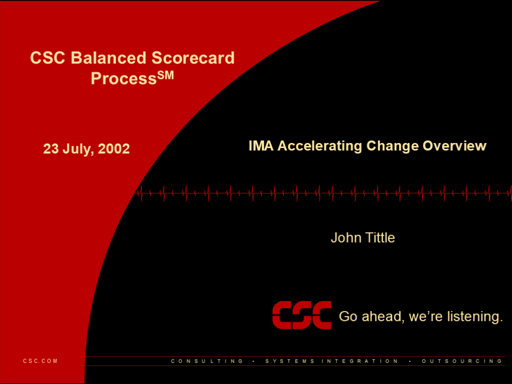
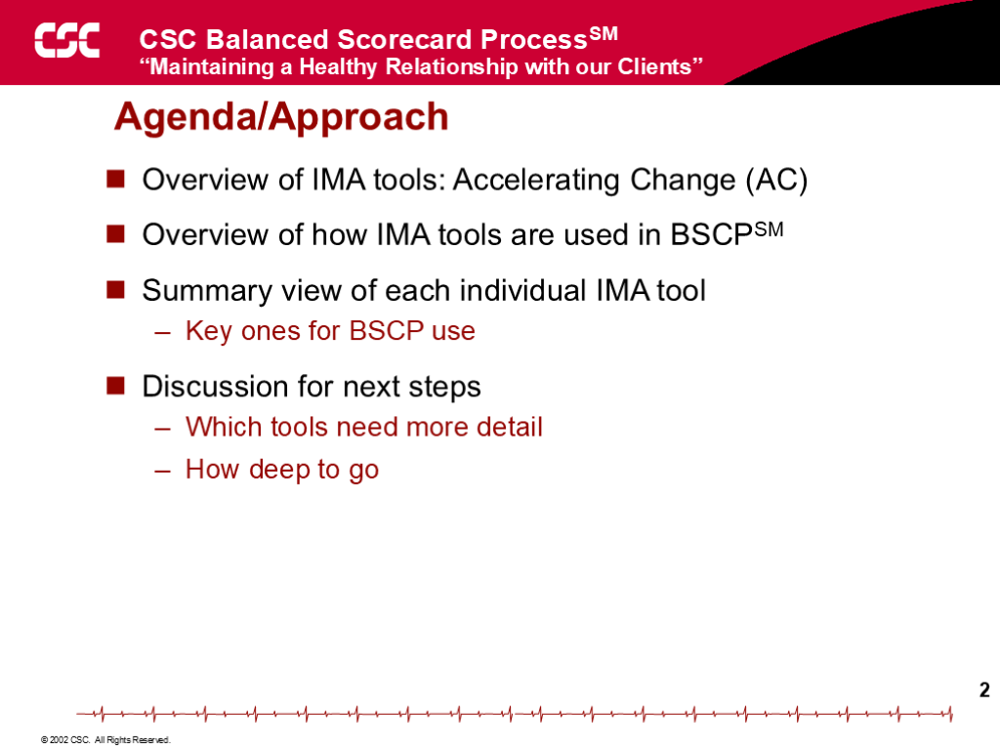
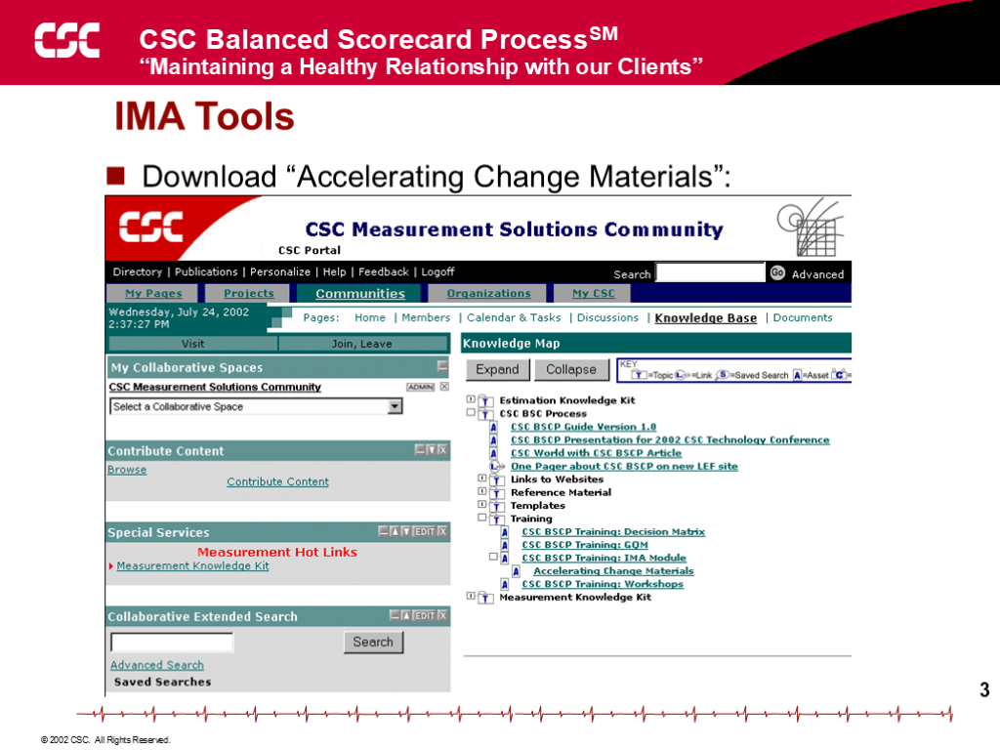
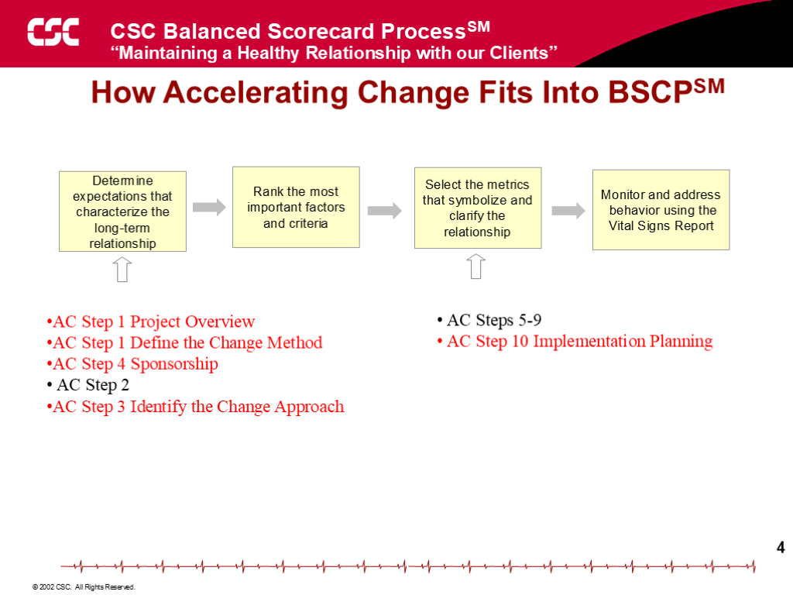
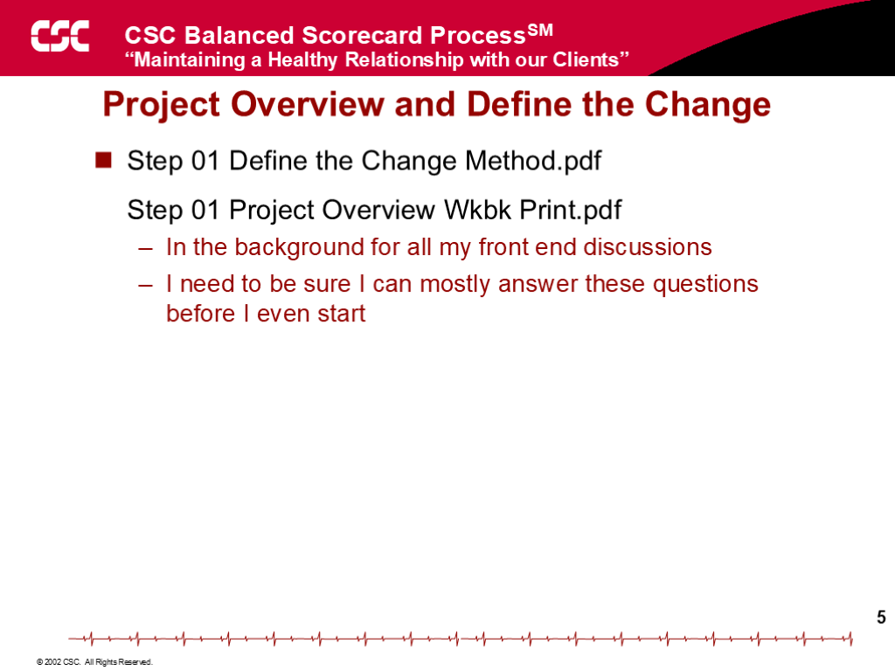
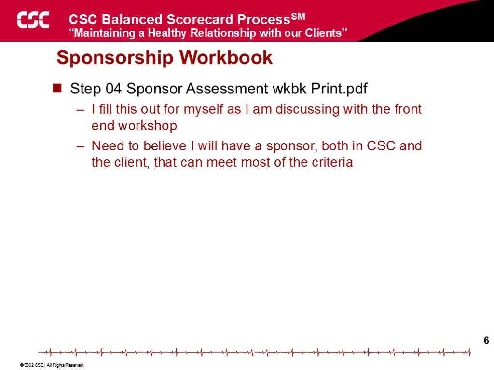
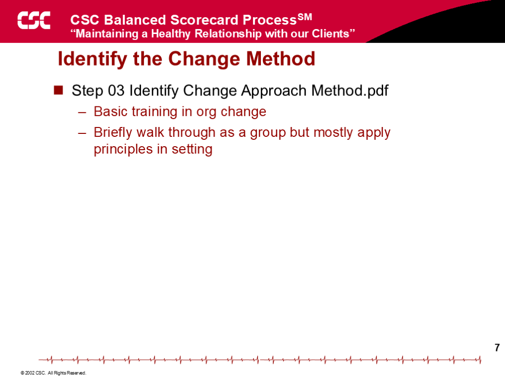
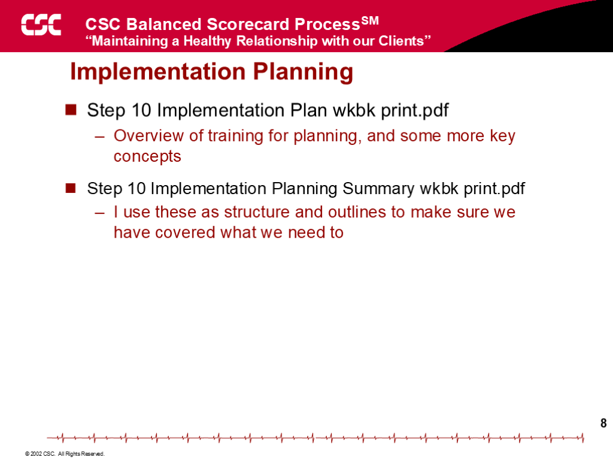

# Training Appendix: Organizational Change Tools

!!! info "Training material from the original BSCP training series"
    This appendix is one of the original training decks developed for delivering the Balanced Scorecard Process to consulting teams. The slides are reproduced here with their original layout for historical fidelity; the text content from each slide is also extracted alongside the image for searchability and accessibility. Era-specific branding in some slides reflects the consulting firm where the methodology was originally developed.

## Slide 1: Balanced Scorecard Process

**23 July, 2002**

- John Tittle

- IMA Accelerating Change Overview

## Slide 2: 2

**Agenda/Approach**

- Overview of IMA tools: Accelerating Change (AC)
- Overview of how IMA tools are used in BSCP
- Summary view of each individual IMA tool
- Key ones for BSCP use
- Discussion for next steps
- Which tools need more detail
- How deep to go

## Slide 3: 3

**IMA Tools**

- Download “Accelerating Change Materials”:

## Slide 4: 4

**How Accelerating Change Fits Into BSCP**

- AC Steps 5-9
- AC Step 10 Implementation Planning

- AC Step 1 Project Overview
- AC Step 1 Define the Change Method
- AC Step 4 Sponsorship
- AC Step 2
- AC Step 3 Identify the Change Approach

- Monitor and address
- behavior using the
- Vital Signs Report

- Rank the most important factors and criteria

- Determine expectations that characterize the long-term relationship

- Select the metrics that symbolize and clarify the relationship

## Slide 5: 5

**Project Overview and Define the Change**

- Step 01 Define the Change Method.pdf
- Step 01 Project Overview Wkbk Print.pdf
- In the background for all my front end discussions
- I need to be sure I can mostly answer these questions before I even start

## Slide 6: 6

**Sponsorship Workbook**

- Step 04 Sponsor Assessment wkbk Print.pdf
- I fill this out for myself as I am discussing with the front end workshop
- Need to believe I will have a sponsor, both in the firm and the client, that can meet most of the criteria

## Slide 7: 7

**Identify the Change Method**

- Step 03 Identify Change Approach Method.pdf
- Basic training in org change
- Briefly walk through as a group but mostly apply principles in setting

## Slide 8: 8

**Implementation Planning**

- Step 10 Implementation Plan wkbk print.pdf
- Overview of training for planning, and some more key concepts
- Step 10 Implementation Planning Summary wkbk print.pdf
- I use these as structure and outlines to make sure we have covered what we need to

