# Training Appendix: Decision Matrix

!!! info "Training material from the original BSCP training series"
    This appendix is one of the original training decks developed for delivering the Balanced Scorecard Process to consulting teams. The slides are reproduced here with their original layout for historical fidelity; the text content from each slide is also extracted alongside the image for searchability and accessibility. Era-specific branding in some slides reflects the consulting firm where the methodology was originally developed.

## Slide 1: Balanced Scorecard Process

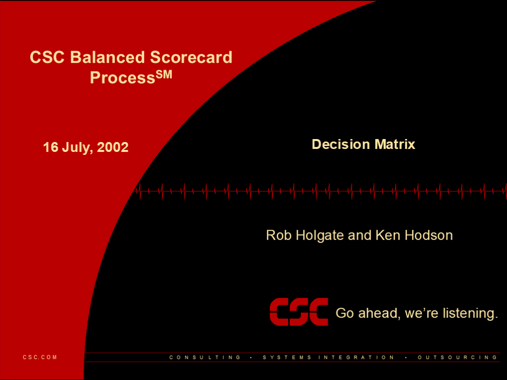

**16 July, 2002**

- Rob Holgate and Ken Hodson

- Decision Matrix

## Slide 2: 2

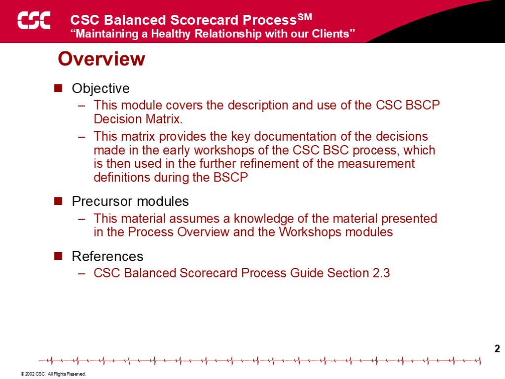

**Overview**

- Objective
- This module covers the description and use of the BSCP Decision Matrix.
- This matrix provides the key documentation of the decisions made in the early workshops of the BSC process, which is then used in the further refinement of the measurement definitions during the BSCP
- Precursor modules
- This material assumes a knowledge of the material presented in the Process Overview and the Workshops modules
- References
- the firm Balanced Scorecard Process Guide Section 2.3

## Slide 3: 3

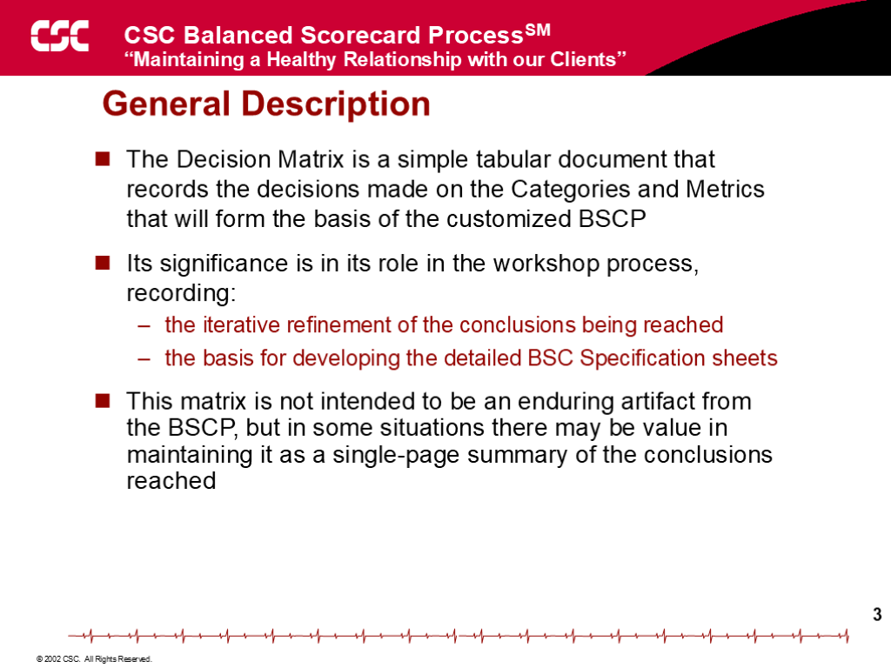

**General Description**

- The Decision Matrix is a simple tabular document that records the decisions made on the Categories and Metrics that will form the basis of the customized BSCP
- Its significance is in its role in the workshop process, recording:
- the iterative refinement of the conclusions being reached
- the basis for developing the detailed BSC Specification sheets
- This matrix is not intended to be an enduring artifact from the BSCP, but in some situations there may be value in maintaining it as a single-page summary of the conclusions reached

## Slide 4: 4

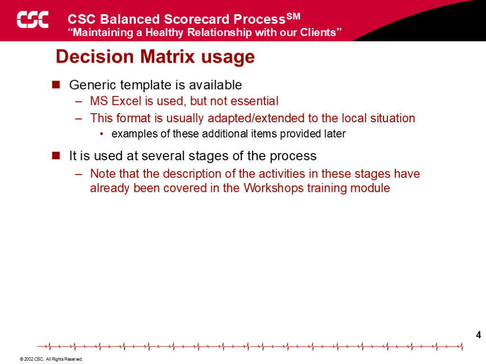

**Decision Matrix usage**

- Generic template is available
- MS Excel is used, but not essential
- This format is usually adapted/extended to the local situation
- examples of these additional items provided later
- It is used at several stages of the process
- Note that the description of the activities in these stages have already been covered in the Workshops training module

## Slide 5: 5

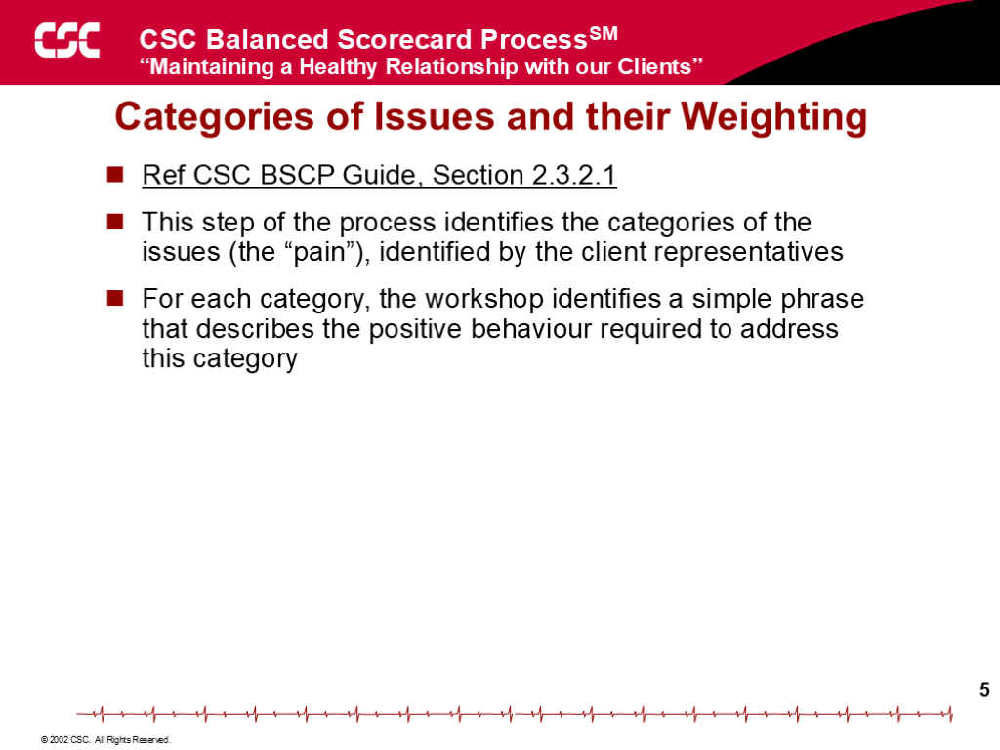

**Categories of Issues and their Weighting**

- Ref BSCP Guide, Section 2.3.2.1
- This step of the process identifies the categories of the issues (the “pain”), identified by the client representatives
- For each category, the workshop identifies a simple phrase that describes the positive behaviour required to address this category

## Slide 6: 6

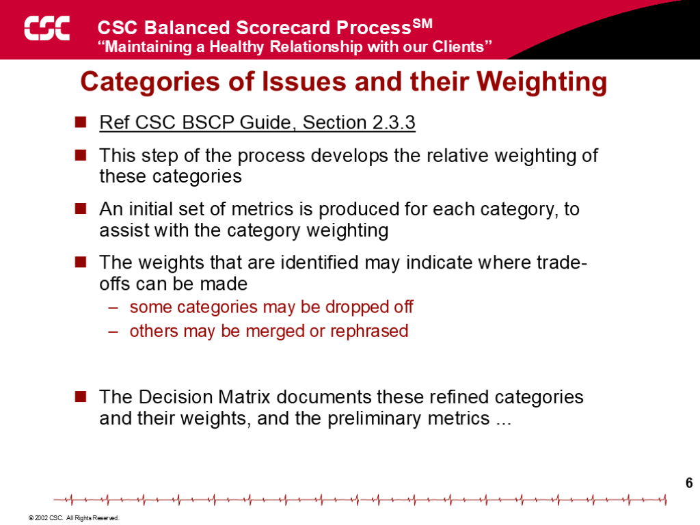

**Categories of Issues and their Weighting**

- Ref BSCP Guide, Section 2.3.3
- This step of the process develops the relative weighting of these categories
- An initial set of metrics is produced for each category, to assist with the category weighting
- The weights that are identified may indicate where trade-offs can be made
- some categories may be dropped off
- others may be merged or rephrased
- The Decision Matrix documents these refined categories and their weights, and the preliminary metrics ...

## Slide 7: 7

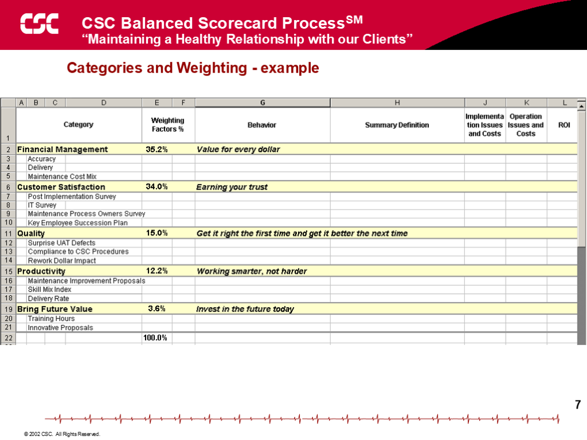

Categories and Weighting - example

## Slide 8: 8

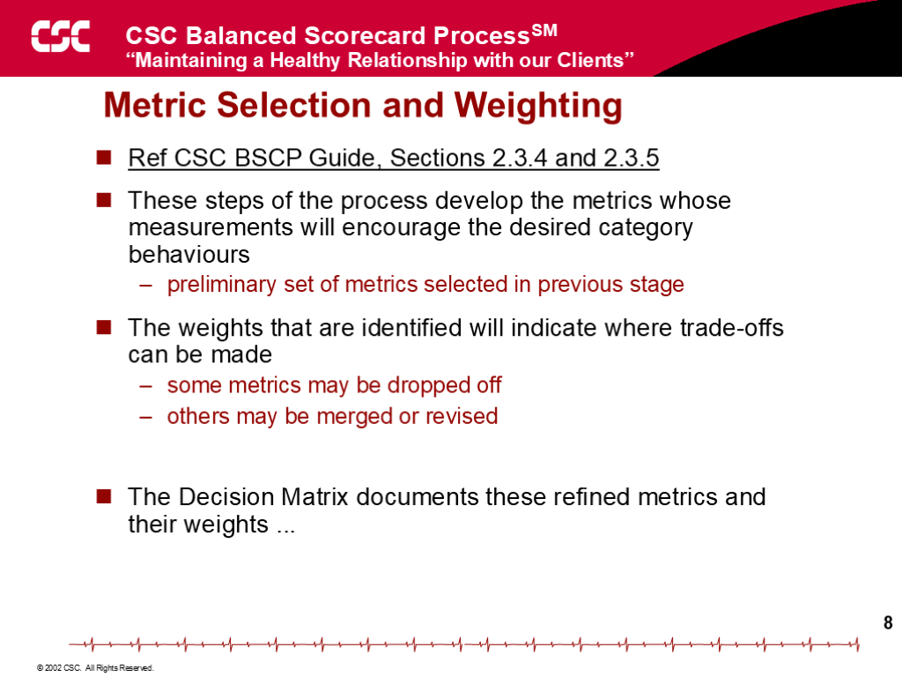

**Metric Selection and Weighting**

- Ref BSCP Guide, Sections 2.3.4 and 2.3.5
- These steps of the process develop the metrics whose measurements will encourage the desired category behaviours
- preliminary set of metrics selected in previous stage
- The weights that are identified will indicate where trade-offs can be made
- some metrics may be dropped off
- others may be merged or revised
- The Decision Matrix documents these refined metrics and their weights ...

## Slide 9: 9

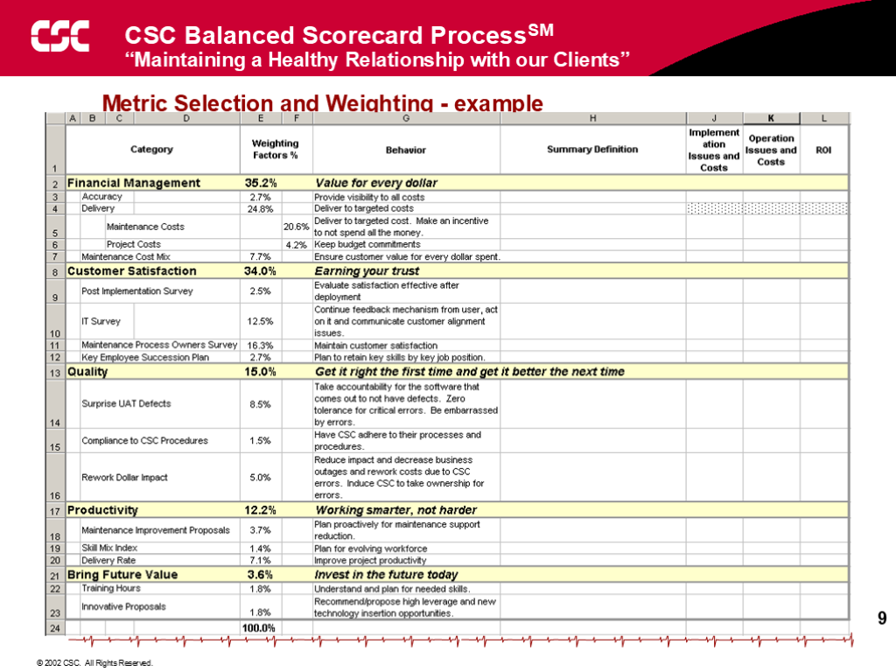

Metric Selection and Weighting - example

## Slide 10: 10

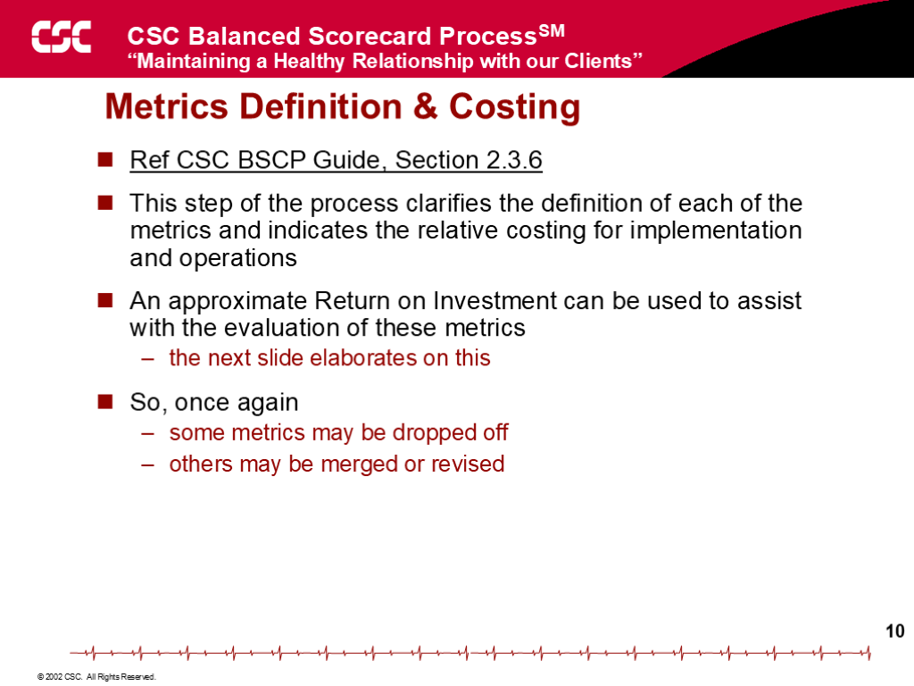

**Metrics Definition & Costing**

- Ref BSCP Guide, Section 2.3.6
- This step of the process clarifies the definition of each of the metrics and indicates the relative costing for implementation and operations
- An approximate Return on Investment can be used to assist with the evaluation of these metrics
- the next slide elaborates on this
- So, once again
- some metrics may be dropped off
- others may be merged or revised

## Slide 11: 11

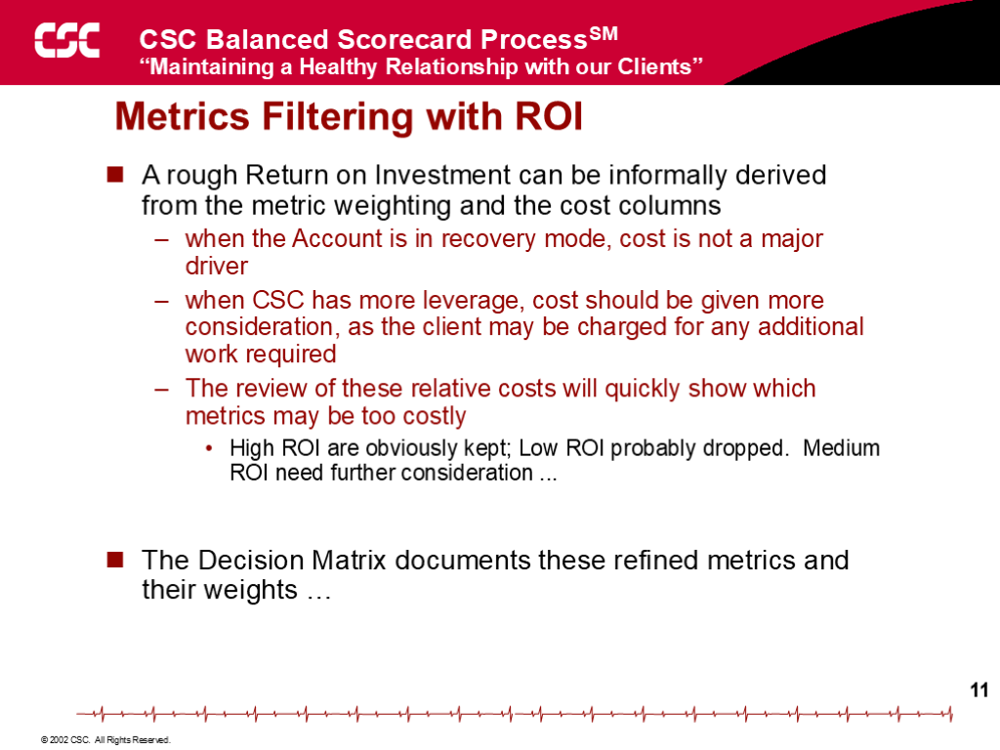

**Metrics Filtering with ROI**

- A rough Return on Investment can be informally derived from the metric weighting and the cost columns
- when the Account is in recovery mode, cost is not a major driver
- when the firm has more leverage, cost should be given more consideration, as the client may be charged for any additional work required
- The review of these relative costs will quickly show which metrics may be too costly
- High ROI are obviously kept; Low ROI probably dropped.  Medium ROI need further consideration ...
- The Decision Matrix documents these refined metrics and their weights …

## Slide 12: 12

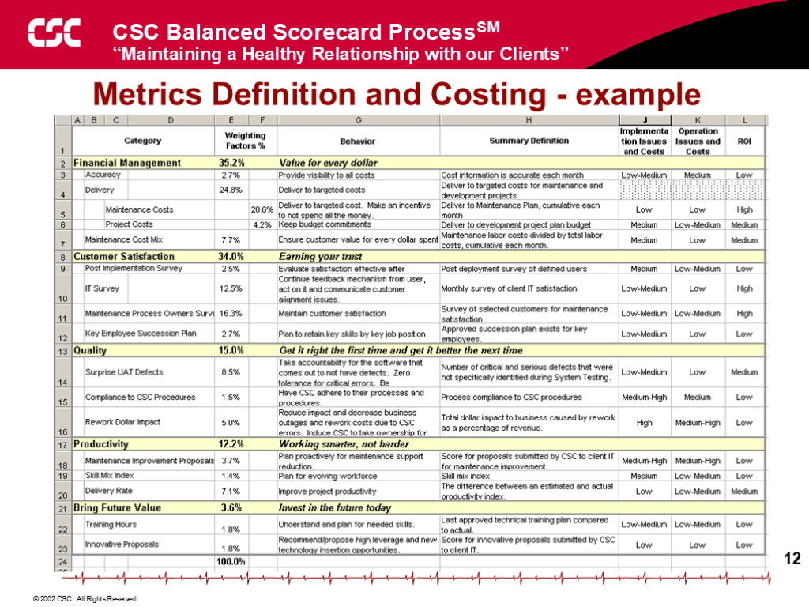

Metrics Definition and Costing - example

## Slide 13: 13

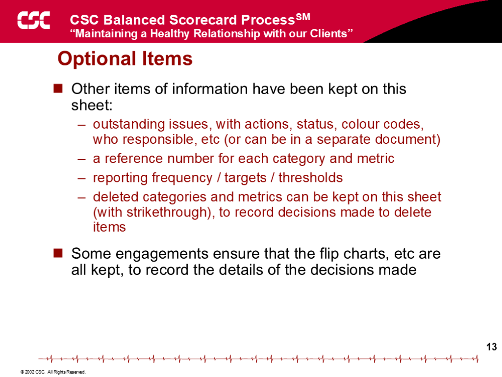

**Optional Items**

- Other items of information have been kept on this sheet:
- outstanding issues, with actions, status, colour codes, who responsible, etc (or can be in a separate document)
- a reference number for each category and metric
- reporting frequency / targets / thresholds
- deleted categories and metrics can be kept on this sheet (with strikethrough), to record decisions made to delete items
- Some engagements ensure that the flip charts, etc are all kept, to record the details of the decisions made

## Slide 14: 14

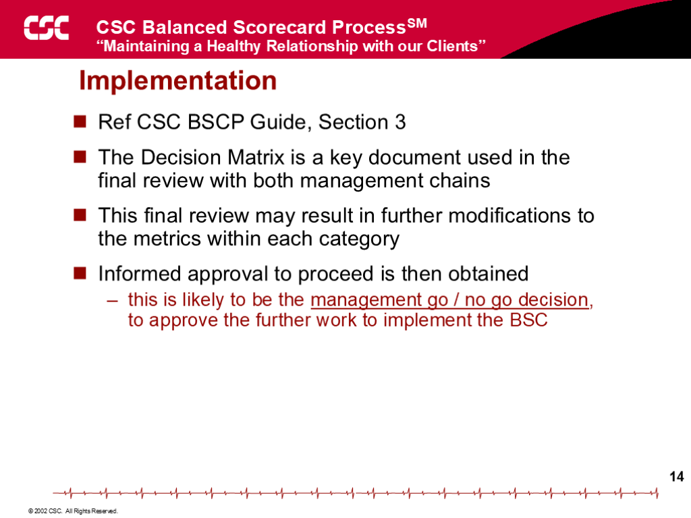

**Implementation**

- Ref BSCP Guide, Section 3
- The Decision Matrix is a key document used in the final review with both management chains
- This final review may result in further modifications to the metrics within each category
- Informed approval to proceed is then obtained
- this is likely to be the management go / no go decision, to approve the further work to implement the BSC

