# Training Appendix: GQM (Goal Question Metric)

!!! info "Training material from the original BSCP training series"
    This appendix is one of the original training decks developed for delivering the Balanced Scorecard Process to consulting teams. The slides are reproduced here with their original layout for historical fidelity; the text content from each slide is also extracted alongside the image for searchability and accessibility. Era-specific branding in some slides reflects the consulting firm where the methodology was originally developed.

## Slide 1: Balanced Scorecard Process

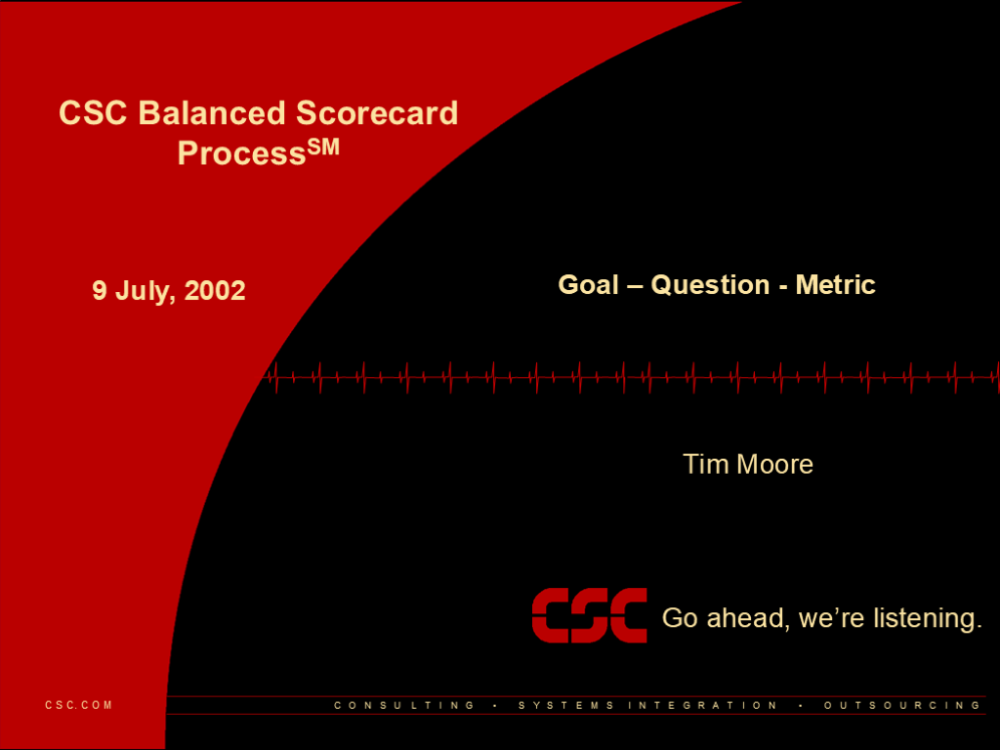

**9 July, 2002**

- Tim Moore

- Goal – Question - Metric

## Slide 2: 2

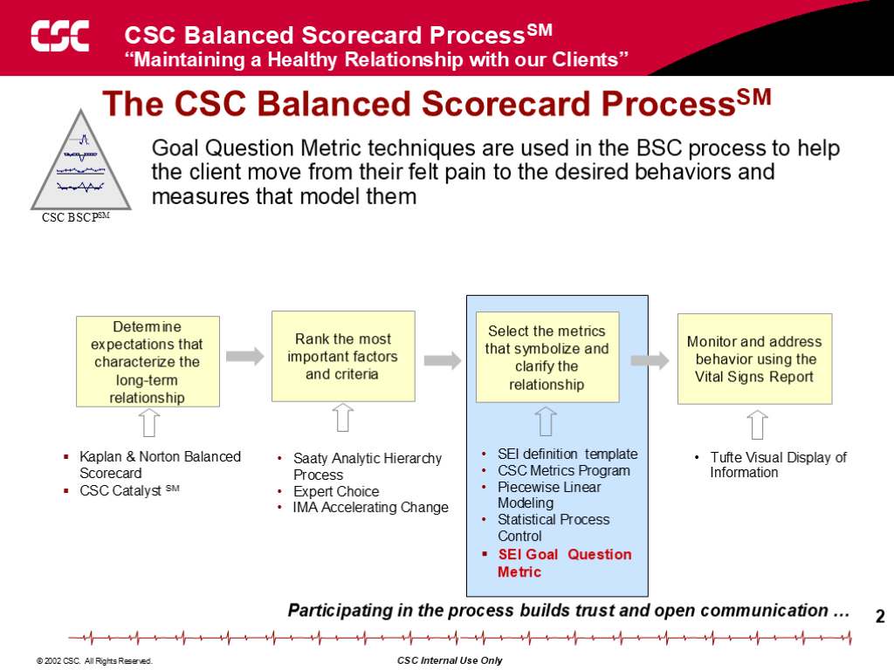

**The Balanced Scorecard Process**

- Goal Question Metric techniques are used in the BSC process to help the client move from their felt pain to the desired behaviors and measures that model them

- Participating in the process builds trust and open communication …

- Kaplan & Norton Balanced Scorecard
- the firm Catalyst

- Determine expectations that characterize the long-term relationship

## Slide 3: 3

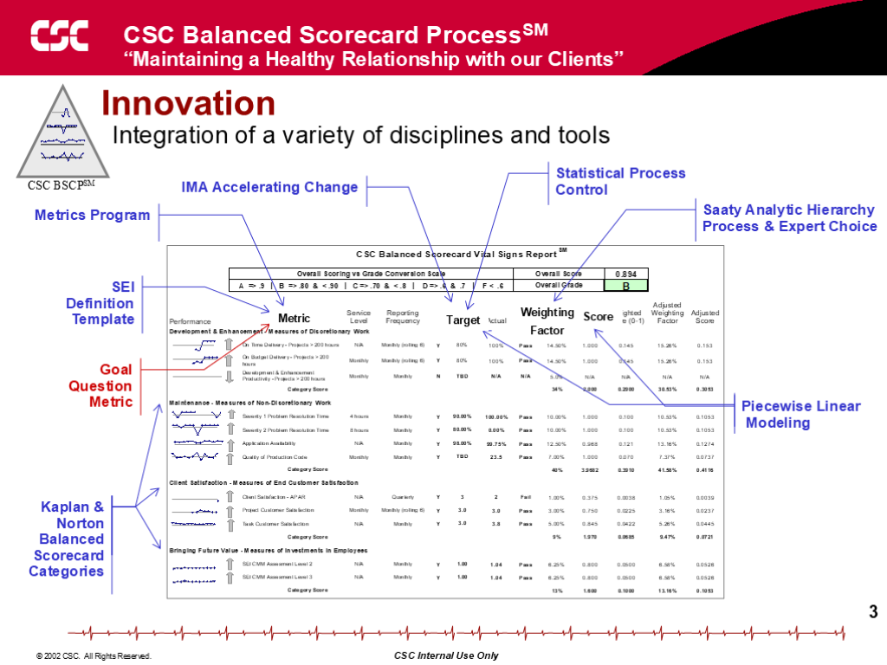

**Innovation**

- Integration of a variety of disciplines and tools

- Kaplan & Norton Balanced Scorecard
- Categories

- Goal Question Metric

- Saaty Analytic Hierarchy Process & Expert Choice

- IMA Accelerating Change

- Piecewise Linear
- Modeling

- SEI Definition Template

- Metrics Program

- Statistical Process Control

- Target

- Metric

- Weighting
- Factor

- Score

## Slide 4: 4

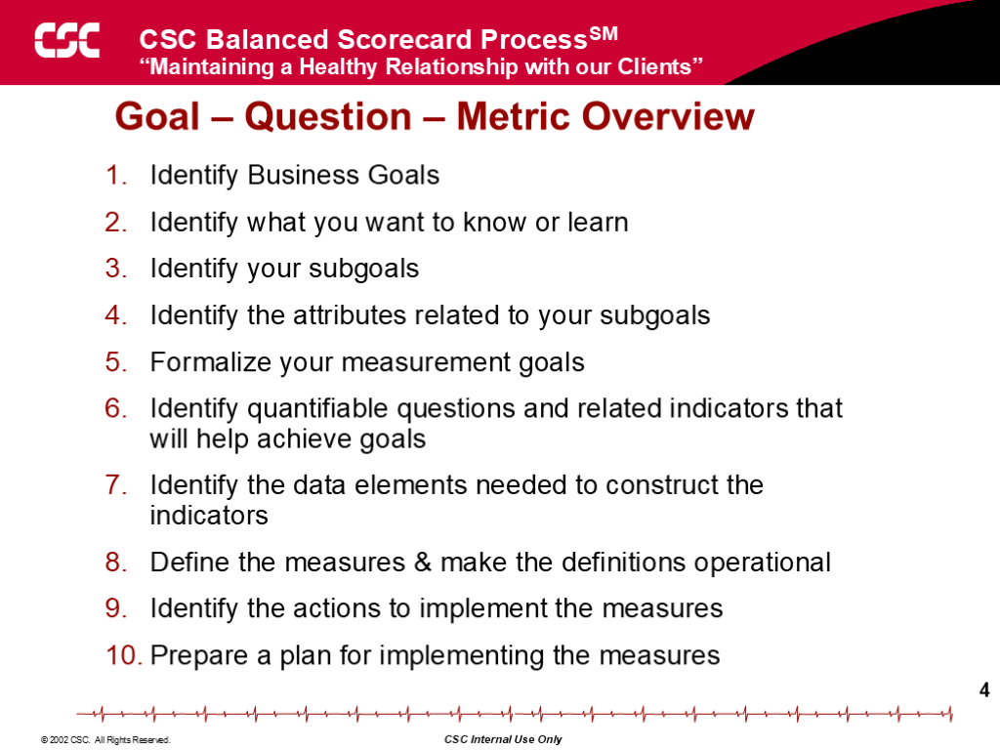

**Goal – Question – Metric Overview**

- Identify Business Goals
- Identify what you want to know or learn
- Identify your subgoals
- Identify the attributes related to your subgoals
- Formalize your measurement goals
- Identify quantifiable questions and related indicators that will help achieve goals
- Identify the data elements needed to construct the indicators
- Define the measures & make the definitions operational
- Identify the actions to implement the measures
- Prepare a plan for implementing the measures

## Slide 5: 5

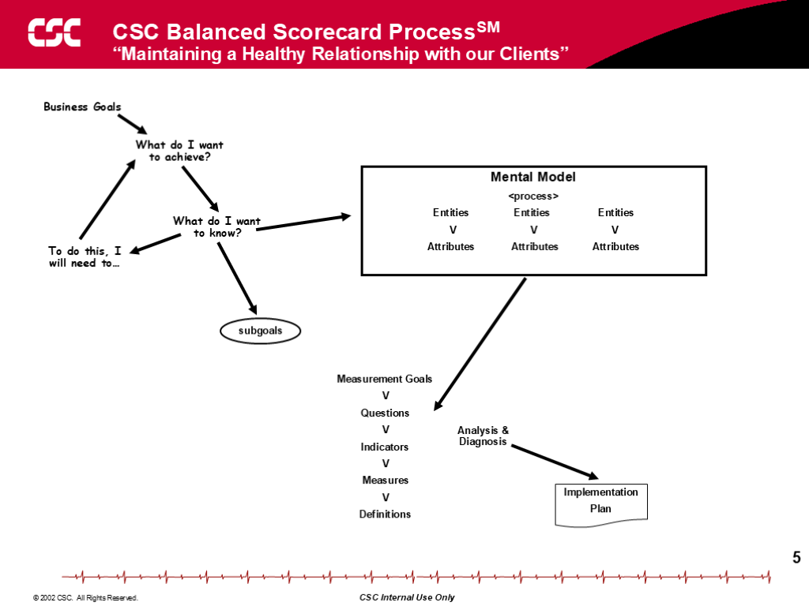

**Business Goals**

- What do I want to achieve?

- To do this, I will need to…

- What do I want to know?

- Mental Model
- <process>
- Entities	Entities	 Entities
- V	V	V
- Attributes	 Attributes	 Attributes

- subgoals

- Measurement Goals
- V
- Questions
- V
- Indicators
- V
- Measures
- V
- Definitions

- Implementation
- Plan

- Analysis & Diagnosis

## Slide 6: 6

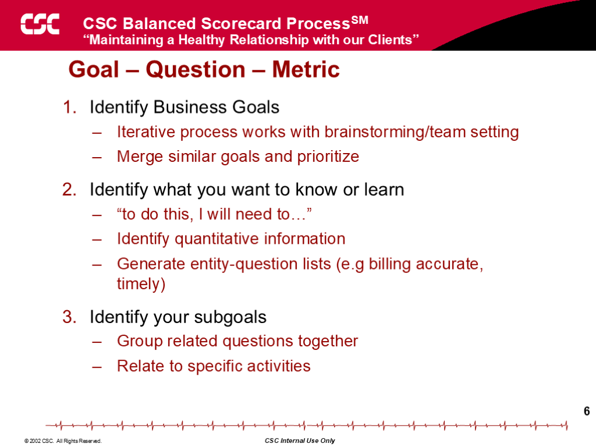

**Goal – Question – Metric**

- Identify Business Goals
- Iterative process works with brainstorming/team setting
- Merge similar goals and prioritize
- Identify what you want to know or learn
- “to do this, I will need to…”
- Identify quantitative information
- Generate entity-question lists (e.g billing accurate, timely)
- Identify your subgoals
- Group related questions together
- Relate to specific activities

## Slide 7: 7

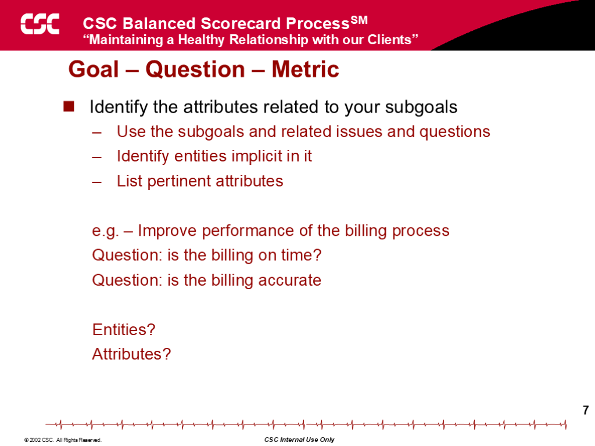

**Goal – Question – Metric**

- Identify the attributes related to your subgoals
- Use the subgoals and related issues and questions
- Identify entities implicit in it
- List pertinent attributes
- e.g. – Improve performance of the billing process
- Question: is the billing on time?
- Question: is the billing accurate
- Entities?
- Attributes?

## Slide 8: 8

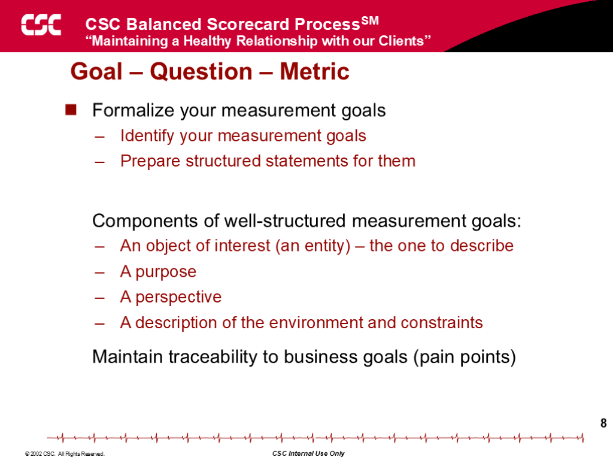

**Goal – Question – Metric**

- Formalize your measurement goals
- Identify your measurement goals
- Prepare structured statements for them
- Components of well-structured measurement goals:
- An object of interest (an entity) – the one to describe
- A purpose
- A perspective
- A description of the environment and constraints
- Maintain traceability to business goals (pain points)

## Slide 9: 9

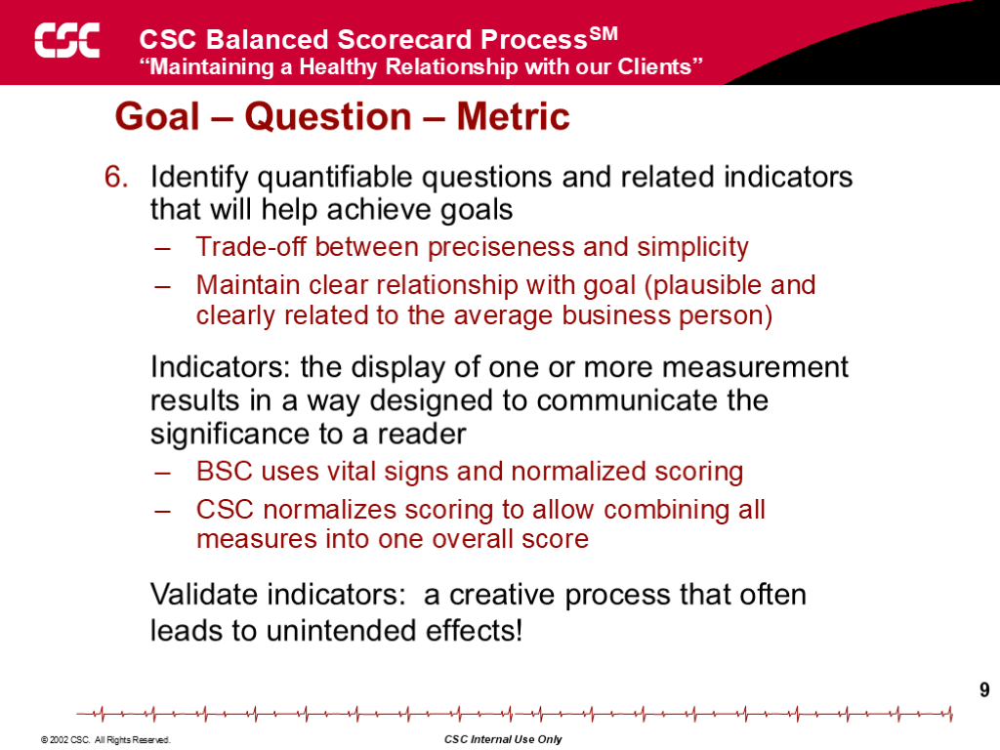

**Goal – Question – Metric**

- Identify quantifiable questions and related indicators that will help achieve goals
- Trade-off between preciseness and simplicity
- Maintain clear relationship with goal (plausible and clearly related to the average business person)
- Indicators: the display of one or more measurement results in a way designed to communicate the significance to a reader
- BSC uses vital signs and normalized scoring
- the firm normalizes scoring to allow combining all measures into one overall score
- Validate indicators:  a creative process that often leads to unintended effects!

## Slide 10: 10

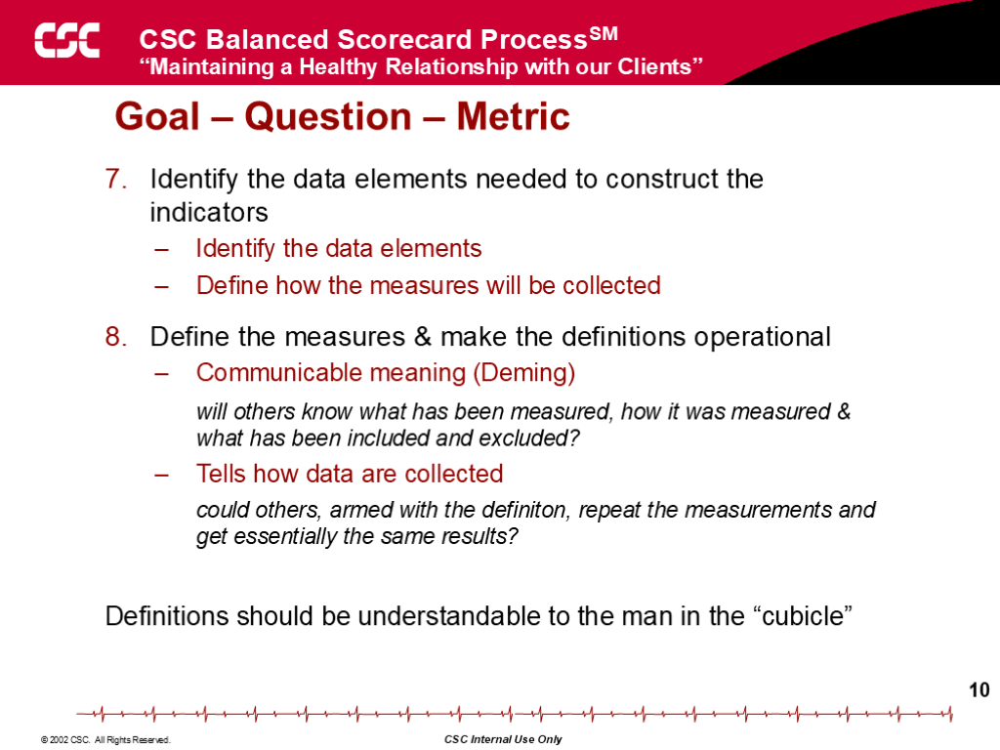

**Goal – Question – Metric**

- Identify the data elements needed to construct the indicators
- Identify the data elements
- Define how the measures will be collected
- Define the measures & make the definitions operational
- Communicable meaning (Deming)
- will others know what has been measured, how it was measured & what has been included and excluded?
- Tells how data are collected
- could others, armed with the definiton, repeat the measurements and get essentially the same results?
- Definitions should be understandable to the man in the “cubicle”

## Slide 11: 11

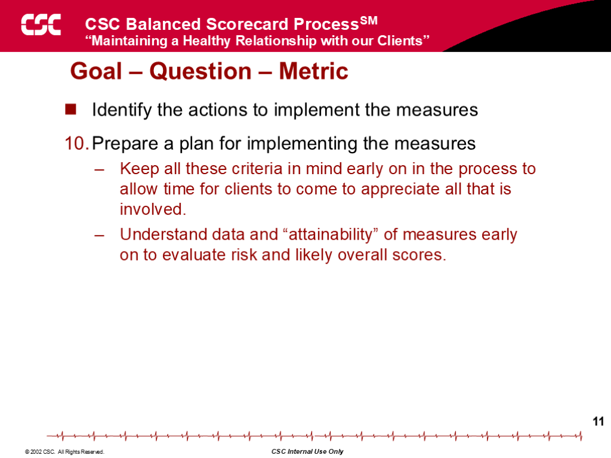

**Goal – Question – Metric**

- Identify the actions to implement the measures
- Prepare a plan for implementing the measures
- Keep all these criteria in mind early on in the process to allow time for clients to come to appreciate all that is involved.
- Understand data and “attainability” of measures early on to evaluate risk and likely overall scores.

