# Training Appendix: Metrics Definition Document

!!! info "Training material from the original BSCP training series"
    This appendix is one of the original training decks developed for delivering the Balanced Scorecard Process to consulting teams. The slides are reproduced here with their original layout for historical fidelity; the text content from each slide is also extracted alongside the image for searchability and accessibility. Era-specific branding in some slides reflects the consulting firm where the methodology was originally developed.

## Slide 1: Balanced Scorecard Process

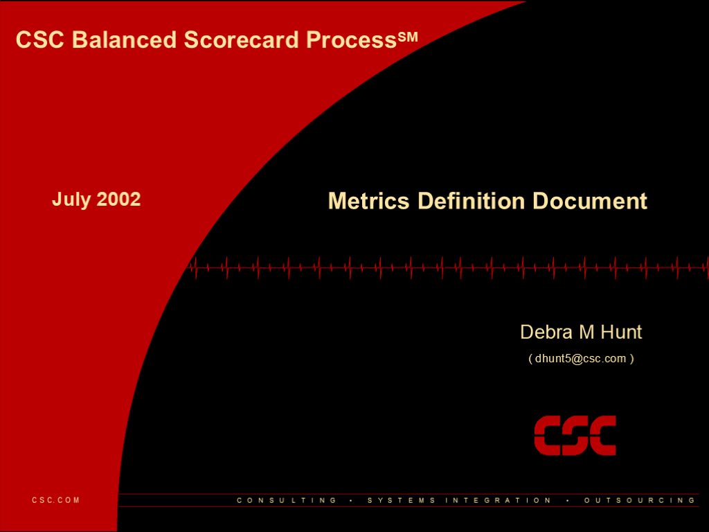

**July 2002**

- Debra M Hunt
- ( dhunt5@csc.com )

- Metrics Definition Document

## Slide 2: 2

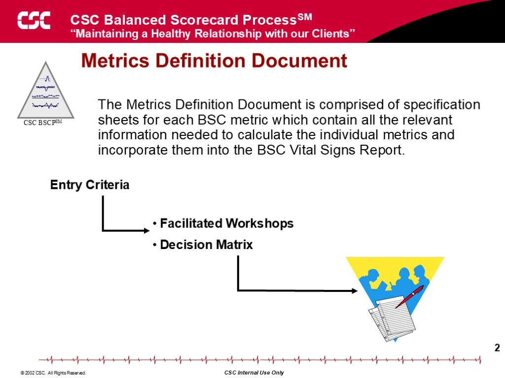

**Metrics Definition Document**

- The Metrics Definition Document is comprised of specification sheets for each BSC metric which contain all the relevant information needed to calculate the individual metrics and incorporate them into the BSC Vital Signs Report.

- Entry Criteria

- Facilitated Workshops
- Decision Matrix

## Slide 3: 3

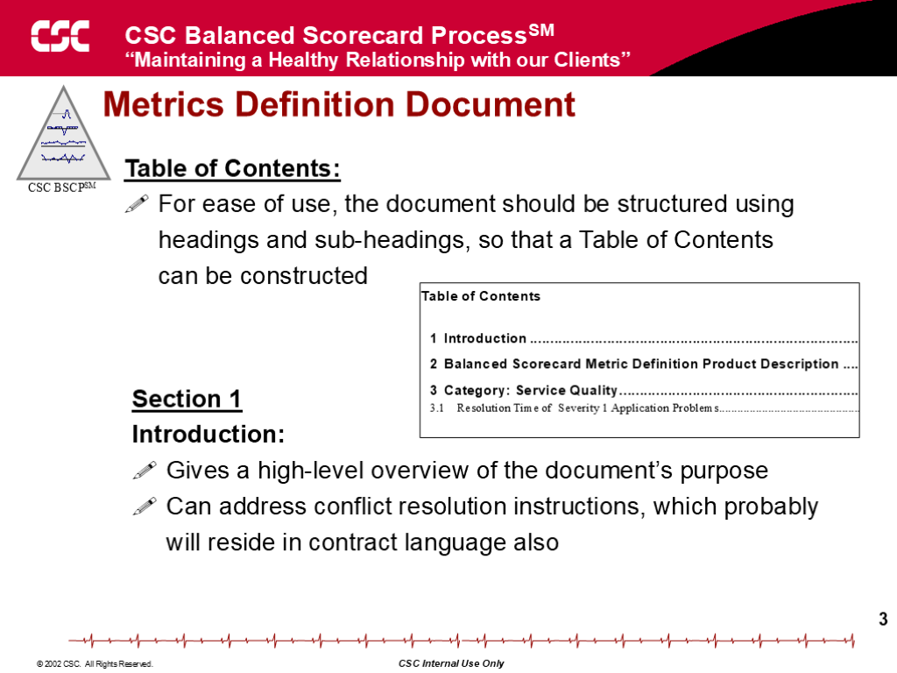

**Metrics Definition Document**

- Section 1
- Introduction:
- Gives a high-level overview of the document’s purpose
- Can address conflict resolution instructions, which probably will reside in contract language also

- Table of Contents:
- For ease of use, the document should be structured using headings and sub-headings, so that a Table of Contents can be constructed

## Slide 4: 4

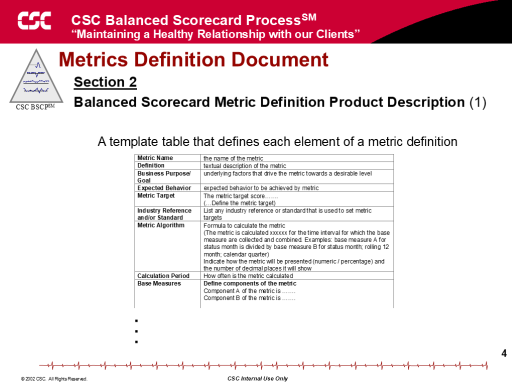

**Metrics Definition Document**

- A template table that defines each element of a metric definition

- Section 2
- Balanced Scorecard Metric Definition Product Description (1)

- .
- .
- .

## Slide 5: 5

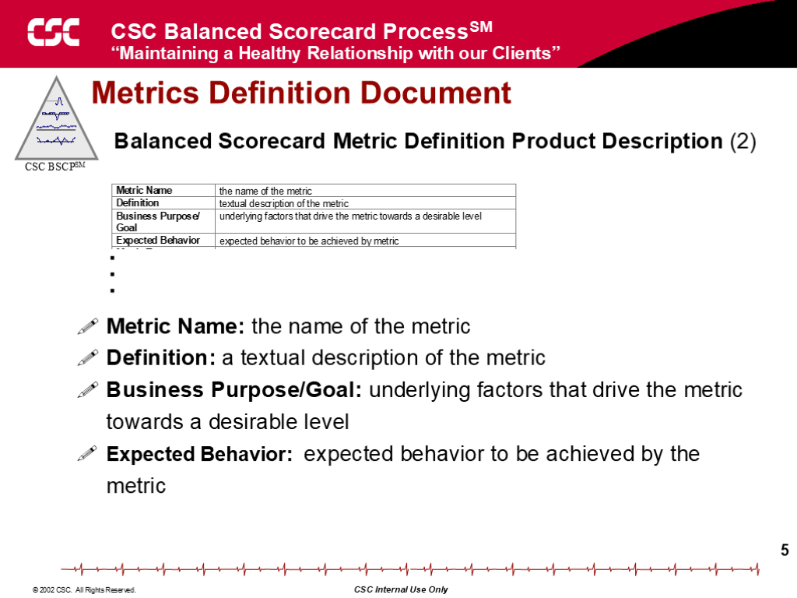

**Metrics Definition Document**

- Metric Name: the name of the metric
- Definition: a textual description of the metric
- Business Purpose/Goal: underlying factors that drive the metric towards a desirable level
- Expected Behavior:  expected behavior to be achieved by the metric

- Balanced Scorecard Metric Definition Product Description (2)

- .
- .
- .

## Slide 6: 6

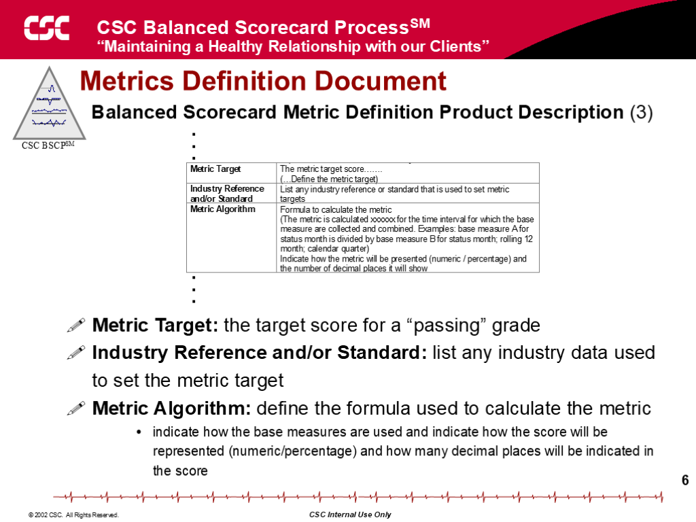

**Metrics Definition Document**

- Metric Target: the target score for a “passing” grade
- Industry Reference and/or Standard: list any industry data used to set the metric target
- Metric Algorithm: define the formula used to calculate the metric
- indicate how the base measures are used and indicate how the score will be represented (numeric/percentage) and how many decimal places will be indicated in the score

- Balanced Scorecard Metric Definition Product Description (3)

- .
- .
- .

- .
- .
- .

## Slide 7: 7

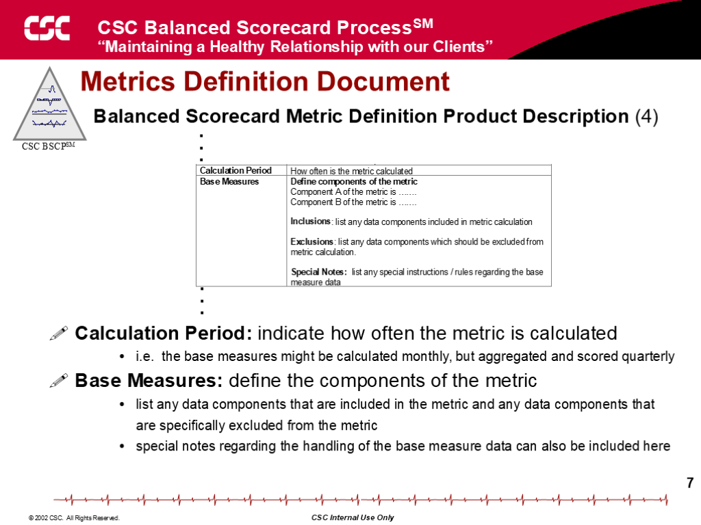

**Metrics Definition Document**

- Calculation Period: indicate how often the metric is calculated
- i.e.  the base measures might be calculated monthly, but aggregated and scored quarterly
- Base Measures: define the components of the metric
- list any data components that are included in the metric and any data components that are specifically excluded from the metric
- special notes regarding the handling of the base measure data can also be included here

- Balanced Scorecard Metric Definition Product Description (4)

- .
- .
- .

- .
- .
- .

## Slide 8: 8

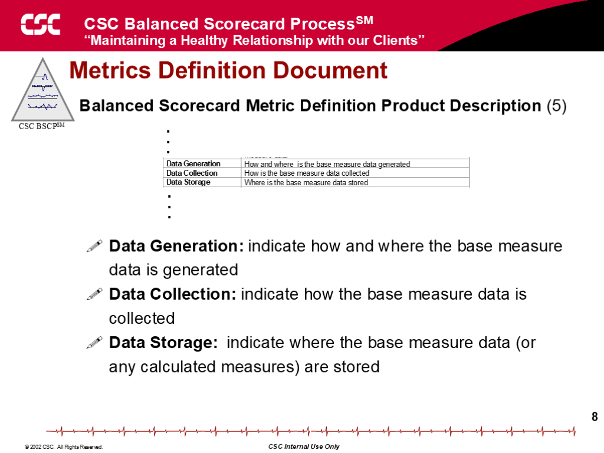

**Metrics Definition Document**

- Data Generation: indicate how and where the base measure data is generated
- Data Collection: indicate how the base measure data is collected
- Data Storage:  indicate where the base measure data (or any calculated measures) are stored

- Balanced Scorecard Metric Definition Product Description (5)

- .
- .
- .

- .
- .
- .

## Slide 9: 9

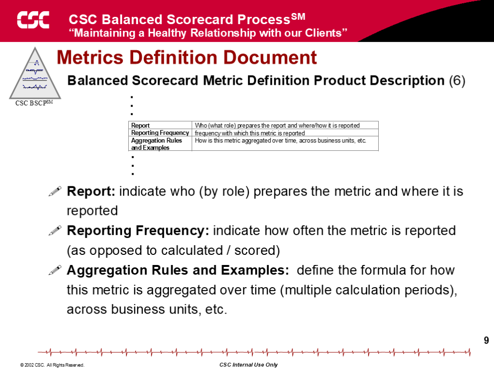

**Metrics Definition Document**

- Report: indicate who (by role) prepares the metric and where it is reported
- Reporting Frequency: indicate how often the metric is reported (as opposed to calculated / scored)
- Aggregation Rules and Examples:  define the formula for how this metric is aggregated over time (multiple calculation periods), across business units, etc.

- Balanced Scorecard Metric Definition Product Description (6)

- .
- .
- .

- .
- .
- .

## Slide 10: 10

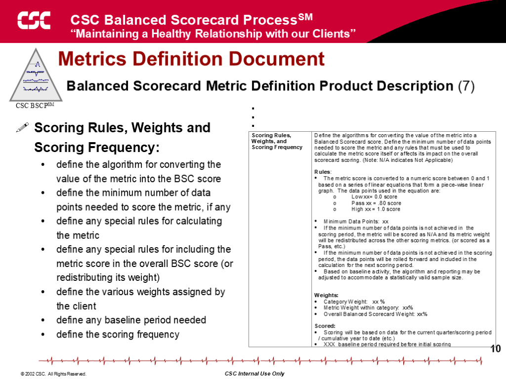

**Metrics Definition Document**

- Scoring Rules, Weights and Scoring Frequency:
- define the algorithm for converting the value of the metric into the BSC score
- define the minimum number of data points needed to score the metric, if any
- define any special rules for calculating the metric
- define any special rules for including the metric score in the overall BSC score (or redistributing its weight)
- define the various weights assigned by the client
- define any baseline period needed
- define the scoring frequency

- Balanced Scorecard Metric Definition Product Description (7)

- .
- .
- .

## Slide 11: 11

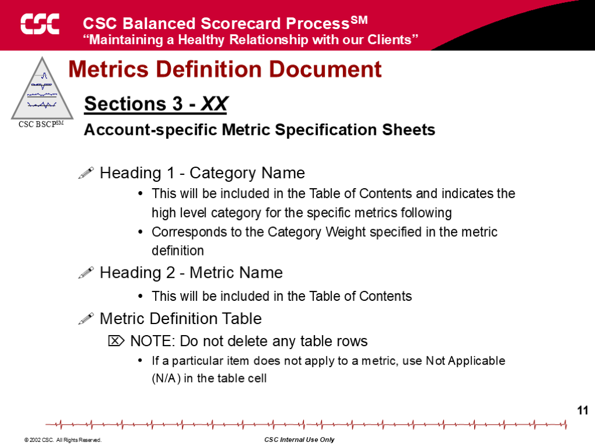

**Metrics Definition Document**

- Heading 1 - Category Name
- This will be included in the Table of Contents and indicates the high level category for the specific metrics following
- Corresponds to the Category Weight specified in the metric definition
- Heading 2 - Metric Name
- This will be included in the Table of Contents
- Metric Definition Table
- NOTE: Do not delete any table rows
- If a particular item does not apply to a metric, use Not Applicable (N/A) in the table cell

- Sections 3 - XX
- Account-specific Metric Specification Sheets

## Slide 12: 12

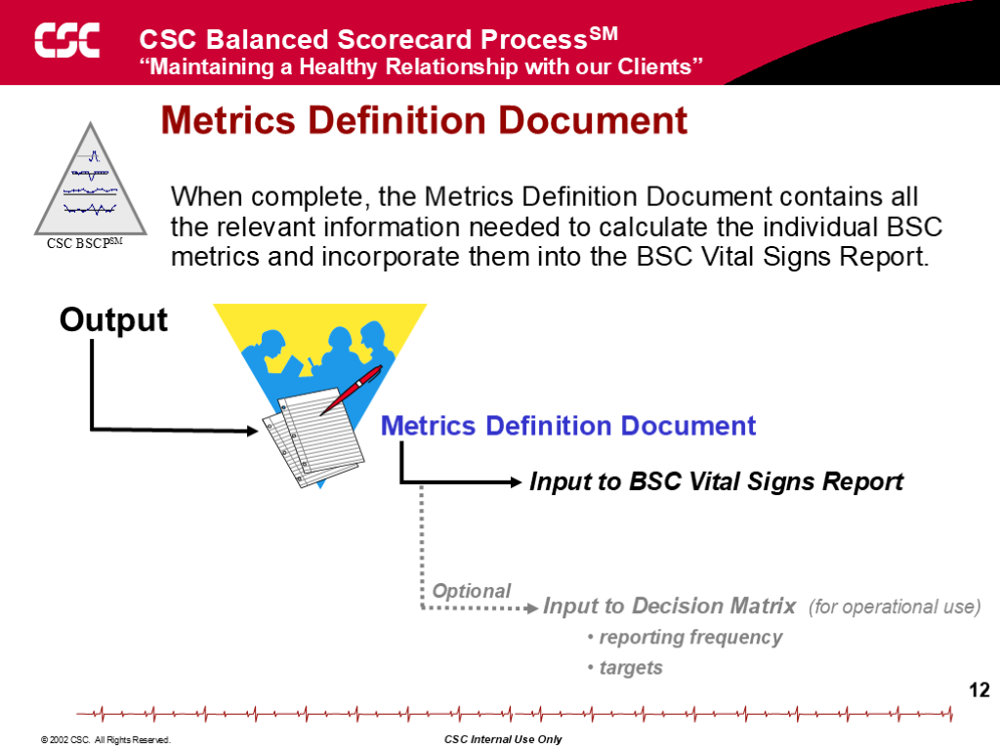

**Metrics Definition Document**

- When complete, the Metrics Definition Document contains all the relevant information needed to calculate the individual BSC metrics and incorporate them into the BSC Vital Signs Report.

- Output

- Input to Decision Matrix  (for operational use)
- reporting frequency
- targets

- Optional

- Metrics Definition Document

- Input to BSC Vital Signs Report

## Slide 13: the firm Proprietary   5/25/2026 12:34:18 PM 008_P2_CSC_white    13

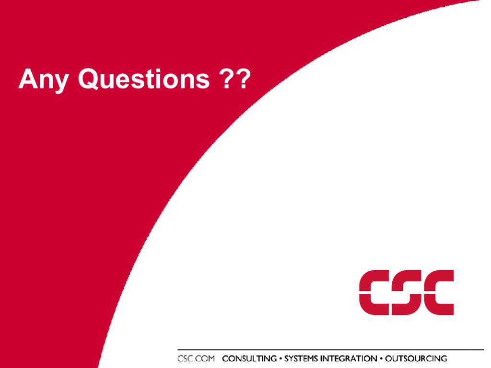

Any Questions ??
