# Training Appendix: SPC (Statistical Process Control)

!!! info "Training material from the original BSCP training series"
    This appendix is one of the original training decks developed for delivering the Balanced Scorecard Process to consulting teams. The slides are reproduced here with their original layout for historical fidelity; the text content from each slide is also extracted alongside the image for searchability and accessibility. Era-specific branding in some slides reflects the consulting firm where the methodology was originally developed.

## Slide 1: Balanced Scorecard Training

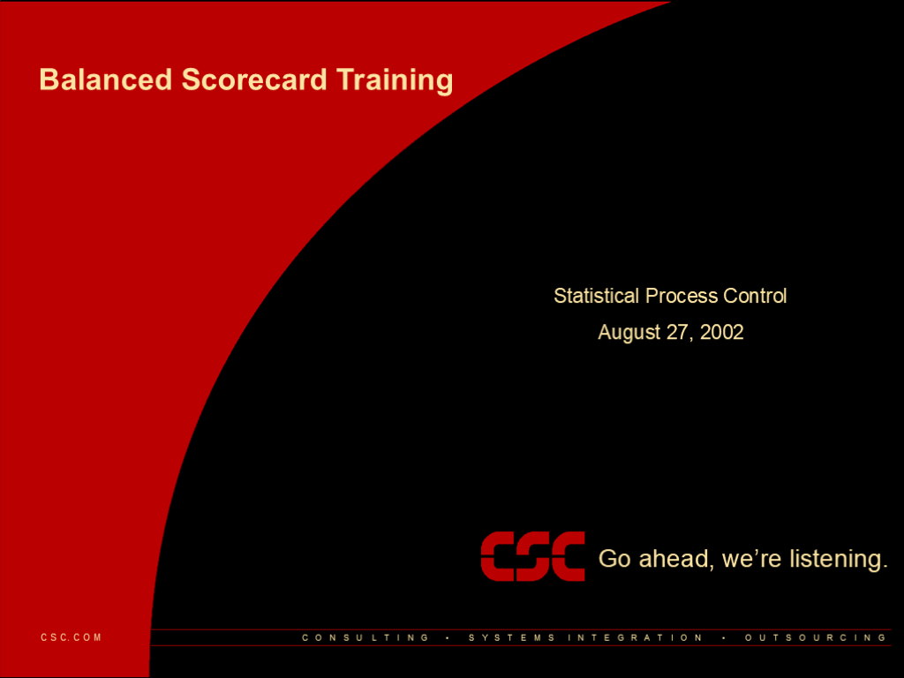

Statistical Process Control
August 27, 2002

## Slide 2: 2

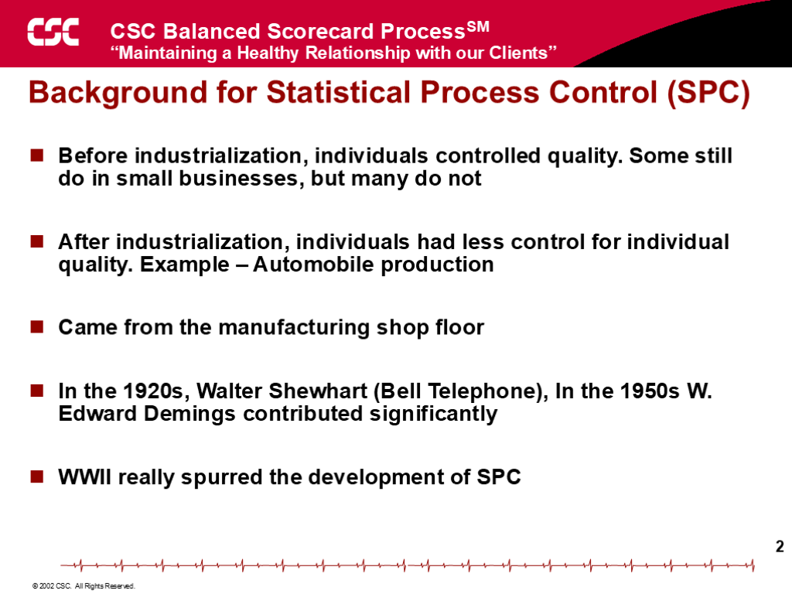

**Background for Statistical Process Control (SPC)**

- Before industrialization, individuals controlled quality. Some still do in small businesses, but many do not
- After industrialization, individuals had less control for individual quality. Example – Automobile production
- Came from the manufacturing shop floor
- In the 1920s, Walter Shewhart (Bell Telephone), In the 1950s W. Edward Demings contributed significantly
- WWII really spurred the development of SPC

## Slide 3: 3

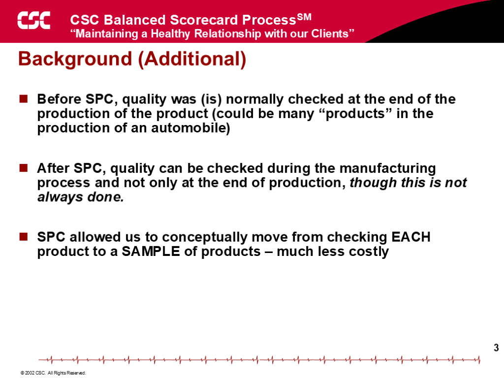

**Background (Additional)**

- Before SPC, quality was (is) normally checked at the end of the production of the product (could be many “products” in the production of an automobile)
- After SPC, quality can be checked during the manufacturing process and not only at the end of production, though this is not always done.
- SPC allowed us to conceptually move from checking EACH product to a SAMPLE of products – much less costly

## Slide 4: 4

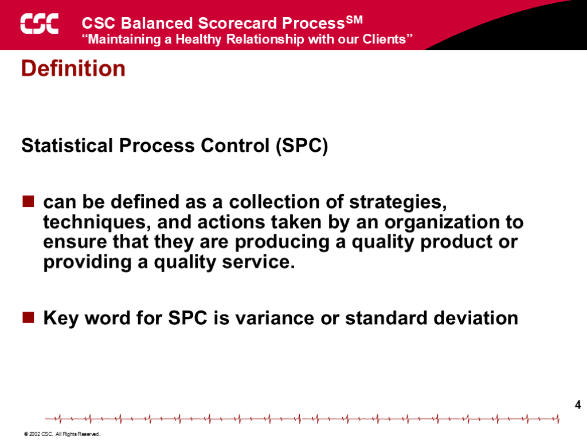

**Definition**

- Statistical Process Control (SPC)
- can be defined as a collection of strategies, techniques, and actions taken by an organization to ensure that they are producing a quality product or providing a quality service.
- Key word for SPC is variance or standard deviation

## Slide 5: 5

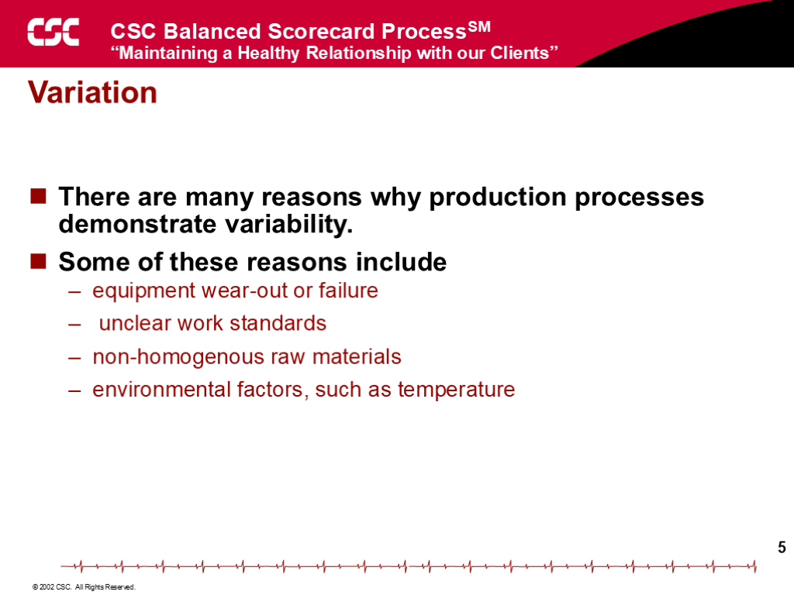

**Variation**

- There are many reasons why production processes demonstrate variability.
- Some of these reasons include
- equipment wear-out or failure
- unclear work standards
- non-homogenous raw materials
- environmental factors, such as temperature

## Slide 6: 6

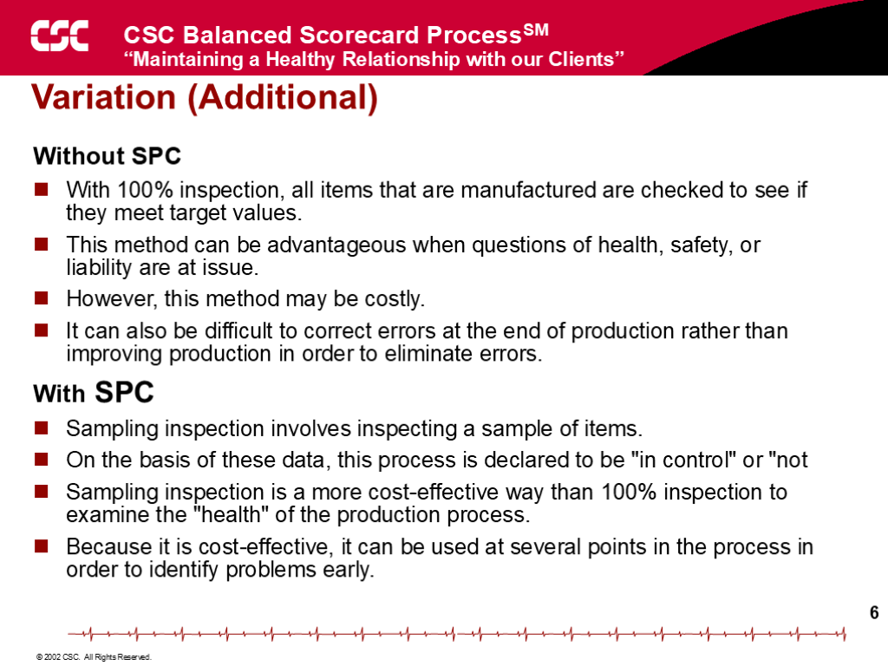

**Variation (Additional)**

- Without SPC
- With 100% inspection, all items that are manufactured are checked to see if they meet target values.
- This method can be advantageous when questions of health, safety, or liability are at issue.
- However, this method may be costly.
- It can also be difficult to correct errors at the end of production rather than improving production in order to eliminate errors.
- With SPC
- Sampling inspection involves inspecting a sample of items.
- On the basis of these data, this process is declared to be "in control" or "not
- Sampling inspection is a more cost-effective way than 100% inspection to examine the "health" of the production process.
- Because it is cost-effective, it can be used at several points in the process in order to identify problems early.

## Slide 7: 7

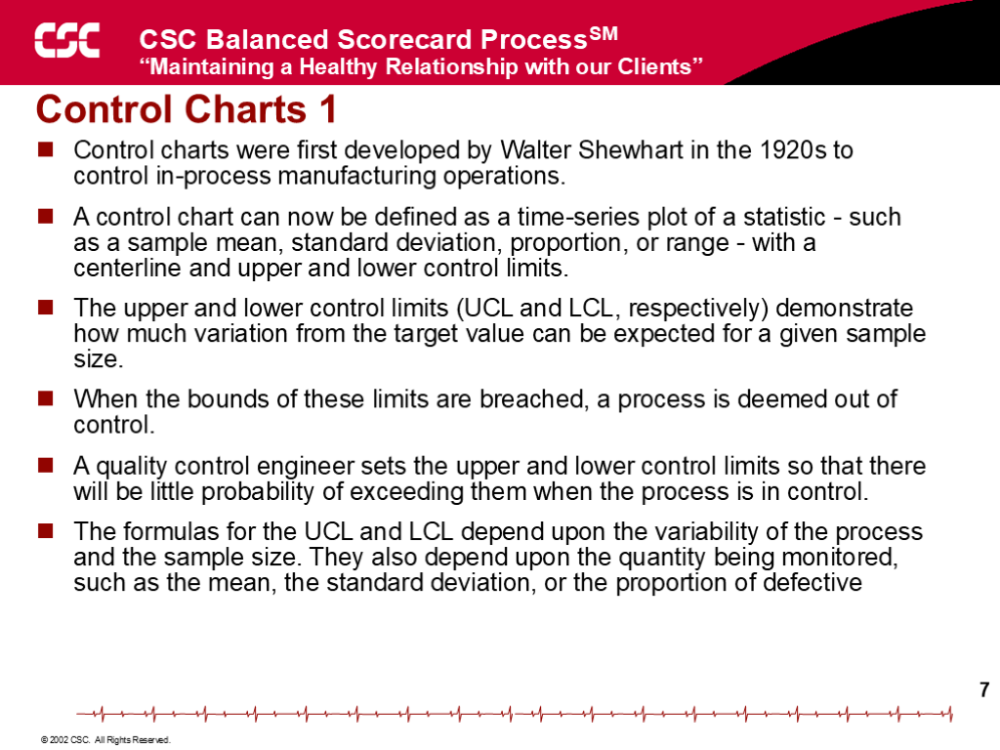

**Control Charts 1**

- Control charts were first developed by Walter Shewhart in the 1920s to control in-process manufacturing operations.
- A control chart can now be defined as a time-series plot of a statistic - such as a sample mean, standard deviation, proportion, or range - with a centerline and upper and lower control limits.
- The upper and lower control limits (UCL and LCL, respectively) demonstrate how much variation from the target value can be expected for a given sample size.
- When the bounds of these limits are breached, a process is deemed out of control.
- A quality control engineer sets the upper and lower control limits so that there will be little probability of exceeding them when the process is in control.
- The formulas for the UCL and LCL depend upon the variability of the process and the sample size. They also depend upon the quantity being monitored, such as the mean, the standard deviation, or the proportion of defective

## Slide 8: 8

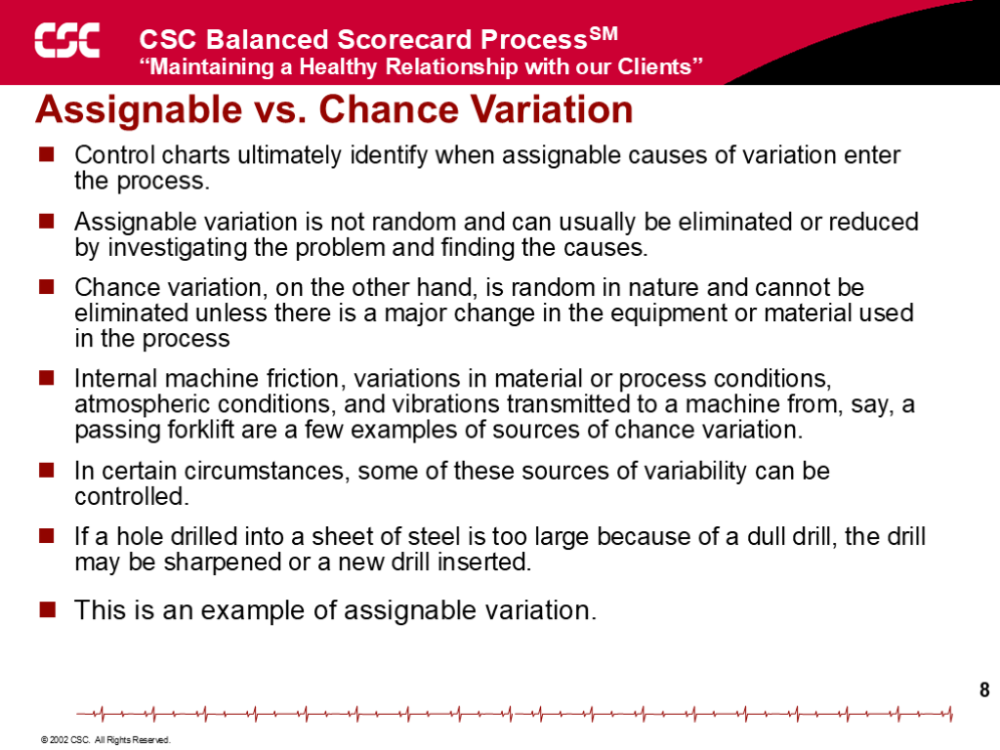

**Assignable vs. Chance Variation**

- Control charts ultimately identify when assignable causes of variation enter the process.
- Assignable variation is not random and can usually be eliminated or reduced by investigating the problem and finding the causes.
- Chance variation, on the other hand, is random in nature and cannot be eliminated unless there is a major change in the equipment or material used in the process
- Internal machine friction, variations in material or process conditions, atmospheric conditions, and vibrations transmitted to a machine from, say, a passing forklift are a few examples of sources of chance variation.
- In certain circumstances, some of these sources of variability can be controlled.
- If a hole drilled into a sheet of steel is too large because of a dull drill, the drill may be sharpened or a new drill inserted.
- This is an example of assignable variation.

## Slide 9: 9

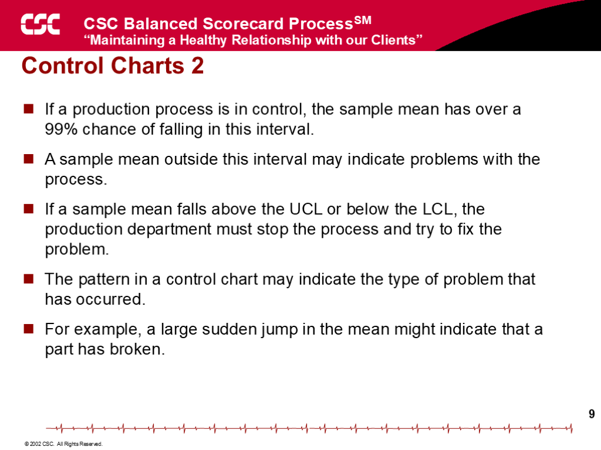

**Control Charts 2**

- If a production process is in control, the sample mean has over a 99% chance of falling in this interval.
- A sample mean outside this interval may indicate problems with the process.
- If a sample mean falls above the UCL or below the LCL, the production department must stop the process and try to fix the problem.
- The pattern in a control chart may indicate the type of problem that has occurred.
- For example, a large sudden jump in the mean might indicate that a part has broken.

## Slide 10: 10

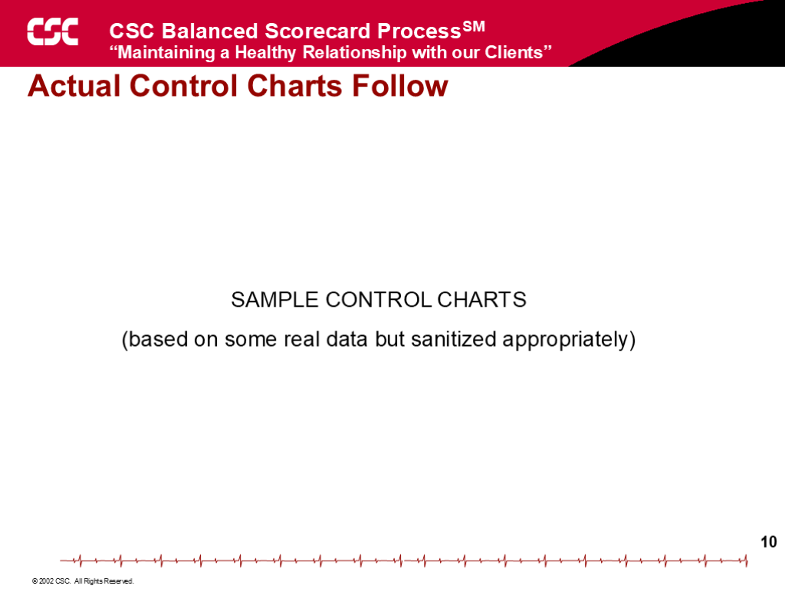

**Actual Control Charts Follow**

- SAMPLE CONTROL CHARTS
- (based on some real data but sanitized appropriately)

## Slide 11: 11

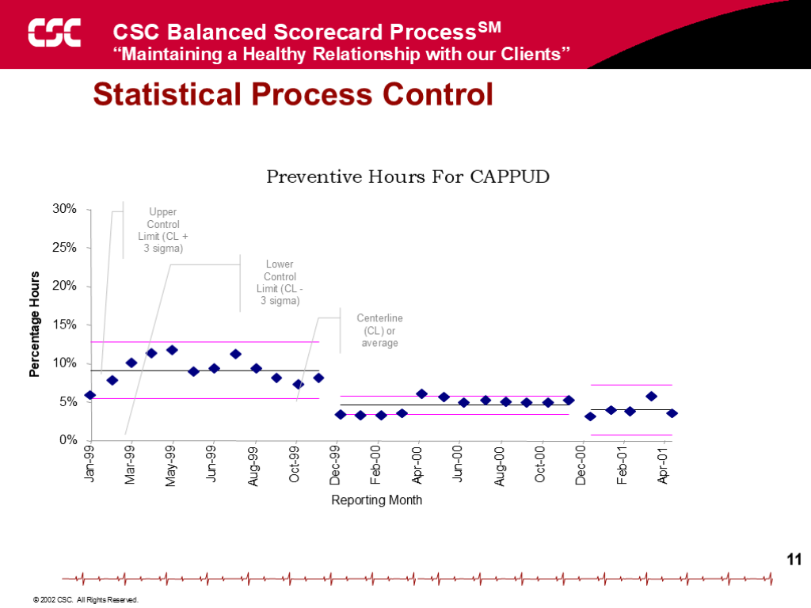

**Statistical Process Control**

- Preventive Hours For CAPPUD

- 0%

- 5%

- 10%

- 15%

- 20%

- 25%

- 30%

- Jan-99

- Mar-99

- May-99

- Jun-99

- Aug-99

- Oct-99

- Dec-99

- Feb-00

- Apr-00

- Jun-00

- Aug-00

- Oct-00

- Dec-00

- Feb-01

- Apr-01

- Reporting Month

- Percentage Hours

- Upper Control Limit (CL + 3 sigma)

- Centerline (CL) or average

- Lower Control Limit (CL -3 sigma)

## Slide 12: 12

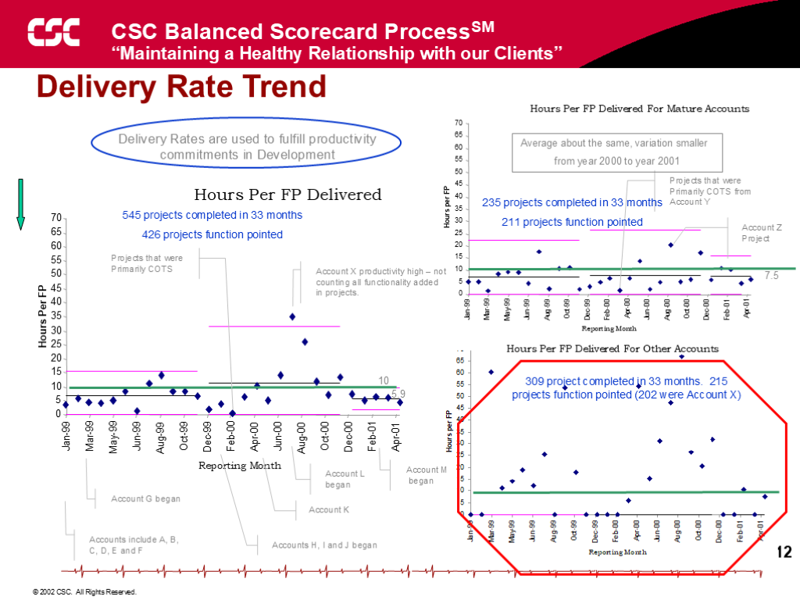

**Hours Per FP Delivered For Mature Accounts**

- 0

- 5

- 10

- 15

- 20

- 25

- 30

- 35

- 40

- 45

- 50

- 55

- 60

- 65

- 70

- Jan-99

- Mar-99

- May-99

- Jun-99

- Aug-99

- Oct-99

- Dec-99

- Feb-00

- Apr-00

- Jun-00

- Aug-00

- Oct-00

- Dec-00

- Feb-01

- Apr-01

- Reporting Month

- Hours per FP

- Delivery Rate Trend

- Hours Per FP Delivered

- 0

- 5

- 10

- 15

- 20

- 25

- 30

- 35

- 40

- 45

- 50

- 55

- 60

- 65

- 70

- Jan-99

- Mar-99

- May-99

- Jun-99

- Aug-99

- Oct-99

- Dec-99

- Feb-00

- Apr-00

- Jun-00

- Aug-00

- Oct-00

- Dec-00

- Feb-01

- Apr-01

- Reporting Month

- Hours Per FP

- Accounts include A, B, C, D, E and F

- Account G began

- Accounts H, I and J began

- Account K

- Account L began

- Account M
- began

- Account X productivity high – not
- counting all functionality added
- in projects.

- Projects that were
- Primarily COTS

- Projects that were
- Primarily COTS from Account Y

- Average about the same, variation smaller
- from year 2000 to year 2001

- Account Z Project

- 10

- 5.9

- 7.5

- Delivery Rates are used to fulfill productivity commitments in Development

- 545 projects completed in 33 months
- 426 projects function pointed

- 235 projects completed in 33 months
- 211 projects function pointed

- 309 project completed in 33 months.  215 projects function pointed (202 were Account X)

- Hours Per FP Delivered For Other Accounts

## Slide 13: 13

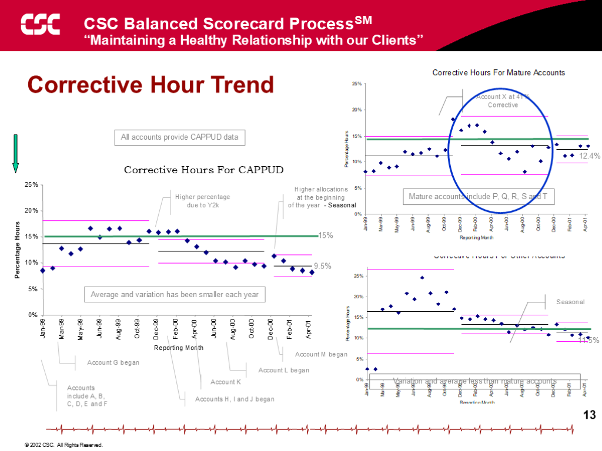

**Corrective Hour Trend**

- Corrective Hours For CAPPUD

- 0%

- 5%

- 10%

- 15%

- 20%

- 25%

- Jan-99

- Mar-99

- May-99

- Jun-99

- Aug-99

- Oct-99

- Dec-99

- Feb-00

- Apr-00

- Jun-00

- Aug-00

- Oct-00

- Dec-00

- Feb-01

- Apr-01

- Reporting Month

- Percentage Hours

- Higher percentage
- due to Y2k

- Higher allocations
- at the beginning
- of the year  - Seasonal

- Accounts include A, B, C, D, E and F

- Account G began

- Account K

- Accounts H, I and J began

- Account L began

- Account M began

- Average and variation has been smaller each year

- Mature accounts include P, Q, R, S and T

- Account X at 41%
- Corrective

- Variation and average less than mature accounts

- All accounts provide CAPPUD data

- Seasonal

- 9.5%

- 12.4%

- 15%

- 11.5%

## Slide 14: 14

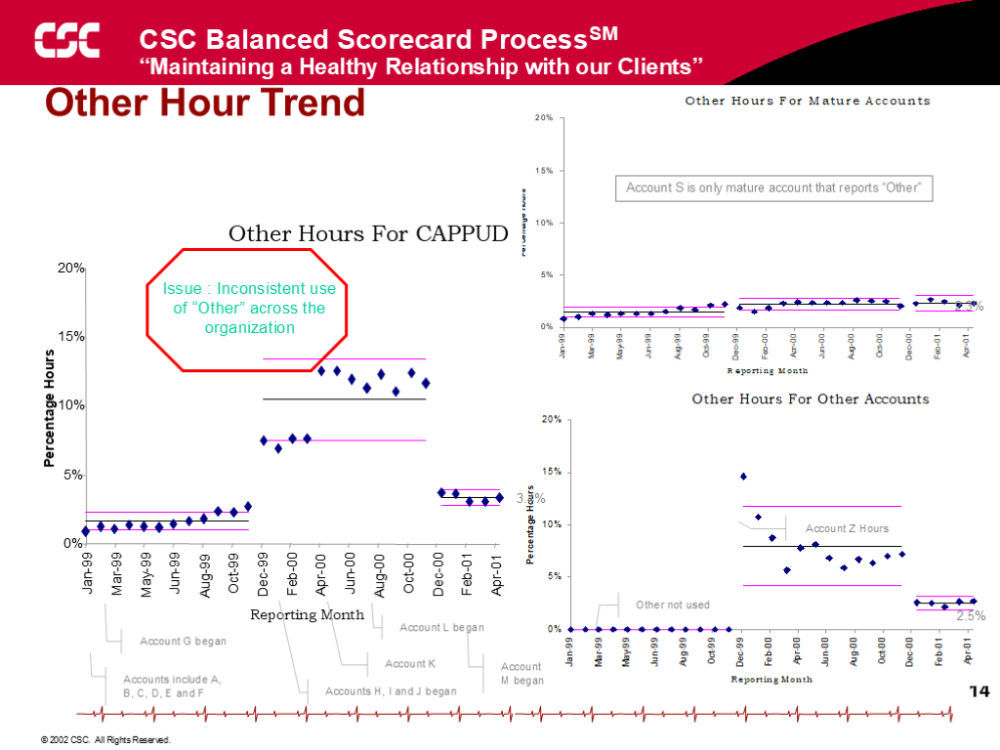

**Other Hour Trend**

- Other Hours For CAPPUD

- 0%

- 5%

- 10%

- 15%

- 20%

- Jan-99

- Mar-99

- May-99

- Jun-99

- Aug-99

- Oct-99

- Dec-99

- Feb-00

- Apr-00

- Jun-00

- Aug-00

- Oct-00

- Dec-00

- Feb-01

- Apr-01

- Reporting Month

- Percentage Hours

- Accounts include A, B, C, D, E and F

- Account G began

- Accounts H, I and J began

- Account K

- Account L began

- Account M began

- Account S is only mature account that reports “Other”

- Other not used

- Account Z Hours

- 3.4%

- 2.3%

- 2.5%

- Issue : Inconsistent use
- of “Other” across the
- organization

## Slide 15: 15

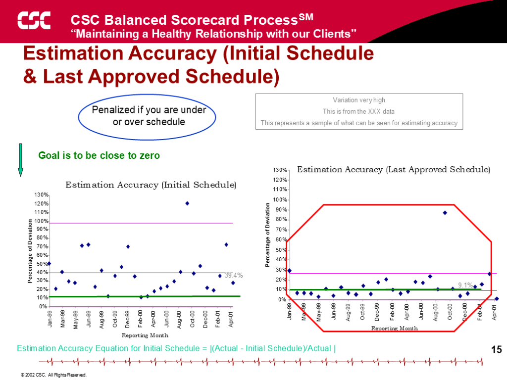

**Estimation Accuracy (Last Approved Schedule)**

- 0%

- 10%

- 20%

- 30%

- 40%

- 50%

- 60%

- 70%

- 80%

- 90%

- 100%

- 110%

- 120%

- 130%

- Jan-99

- Mar-99

- May-99

- Jun-99

- Aug-99

- Oct-99

- Dec-99

- Feb-00

- Apr-00

- Jun-00

- Aug-00

- Oct-00

- Dec-00

- Feb-01

- Apr-01

- Reporting Month

- Percentage of Deviation

- Estimation Accuracy (Initial Schedule)

- 0%

- 10%

- 20%

- 30%

- 40%

- 50%

- 60%

- 70%

- 80%

- 90%

- 100%

- 110%

- 120%

- 130%

- Jan-99

- Mar-99

- May-99

- Jun-99

- Aug-99

- Oct-99

- Dec-99

- Feb-00

- Apr-00

- Jun-00

- Aug-00

- Oct-00

- Dec-00

- Feb-01

- Apr-01

- Reporting Month

- Percentage of Deviation

- Variation very high
- This is from the XXX data
- This represents a sample of what can be seen for estimating accuracy

- 39.4%

- 9.1%

- Estimation Accuracy (Initial Schedule
- & Last Approved Schedule)

- Penalized if you are under
- or over schedule

- Goal is to be close to zero

- Estimation Accuracy Equation for Initial Schedule = |(Actual - Initial Schedule)/Actual |

## Slide 16: 16

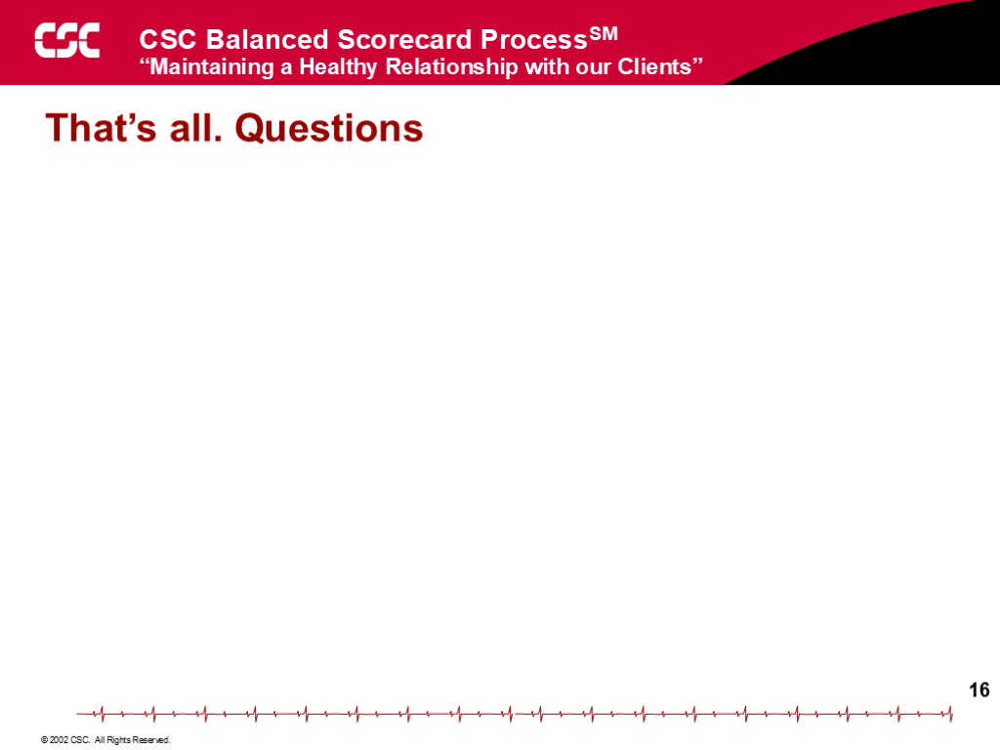

That’s all. Questions
