# Training Appendix: Workshops

!!! info "Training material from the original BSCP training series"
    This appendix is one of the original training decks developed for delivering the Balanced Scorecard Process to consulting teams. The slides are reproduced here with their original layout for historical fidelity; the text content from each slide is also extracted alongside the image for searchability and accessibility. Era-specific branding in some slides reflects the consulting firm where the methodology was originally developed.

## Slide 1: Balanced Scorecard Process

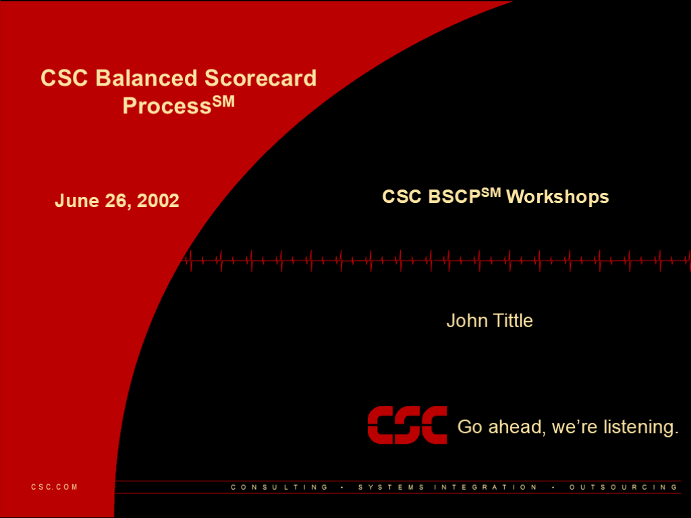

**June 26, 2002**

- John Tittle

- BSCP Workshops

## Slide 2: 2

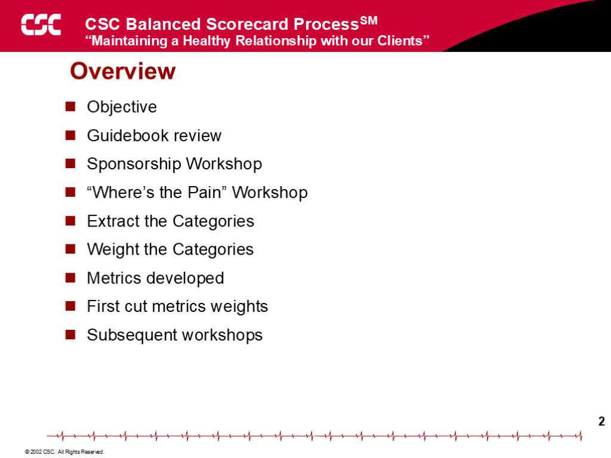

**Overview**

- Objective
- Guidebook review
- Sponsorship Workshop
- “Where’s the Pain” Workshop
- Extract the Categories
- Weight the Categories
- Metrics developed
- First cut metrics weights
- Subsequent workshops

## Slide 3: 3

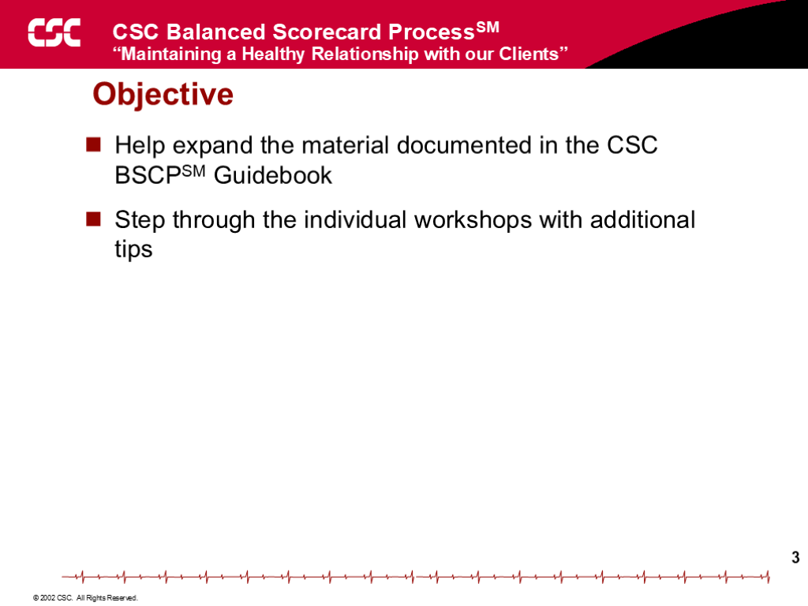

**Objective**

- Help expand the material documented in the BSCP Guidebook
- Step through the individual workshops with additional tips

## Slide 4: 4

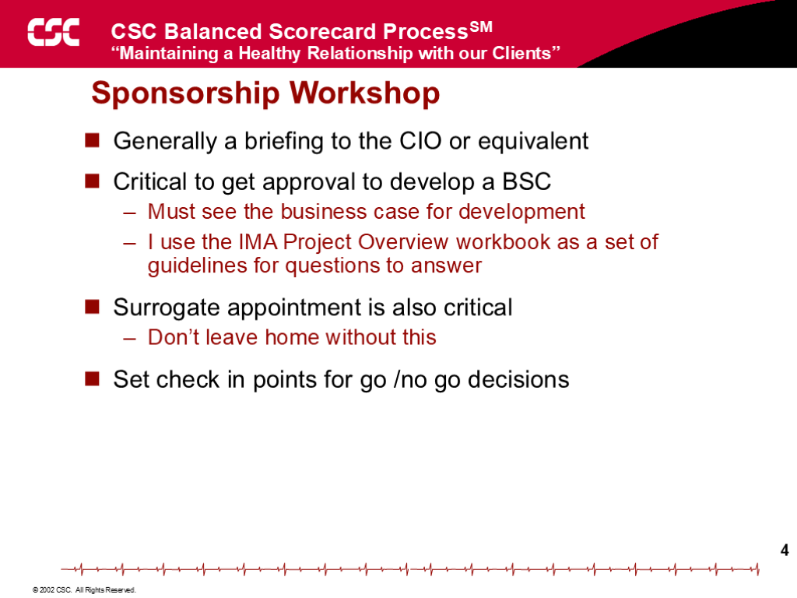

**Sponsorship Workshop**

- Generally a briefing to the CIO or equivalent
- Critical to get approval to develop a BSC
- Must see the business case for development
- I use the IMA Project Overview workbook as a set of guidelines for questions to answer
- Surrogate appointment is also critical
- Don’t leave home without this
- Set check in points for go /no go decisions

## Slide 5: 5

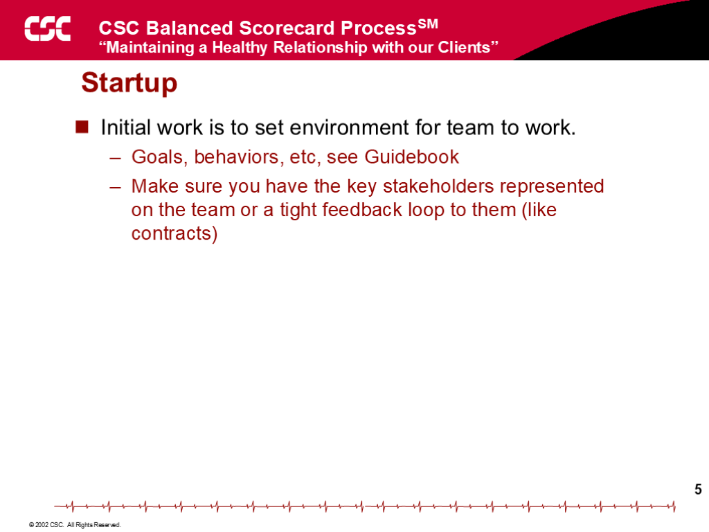

**Startup**

- Initial work is to set environment for team to work.
- Goals, behaviors, etc, see Guidebook
- Make sure you have the key stakeholders represented on the team or a tight feedback loop to them (like contracts)

## Slide 6: 6

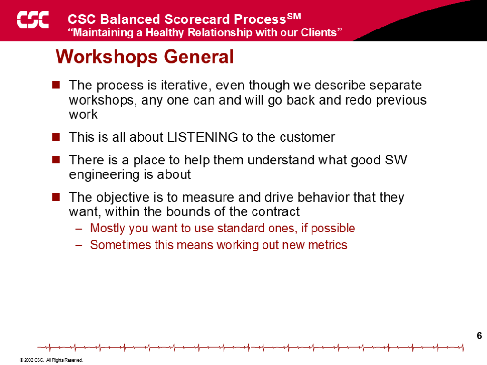

**Workshops General**

- The process is iterative, even though we describe separate workshops, any one can and will go back and redo previous work
- This is all about LISTENING to the customer
- There is a place to help them understand what good SW engineering is about
- The objective is to measure and drive behavior that they want, within the bounds of the contract
- Mostly you want to use standard ones, if possible
- Sometimes this means working out new metrics

## Slide 7: 7

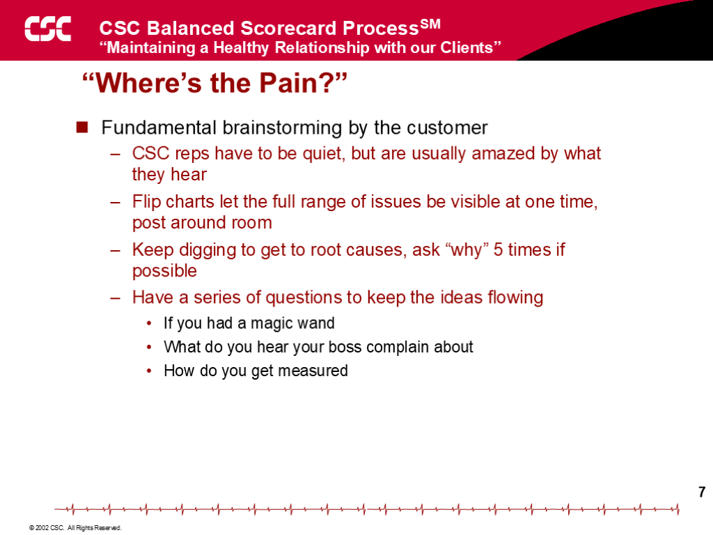

**“Where’s the Pain?”**

- Fundamental brainstorming by the customer
- the firm reps have to be quiet, but are usually amazed by what they hear
- Flip charts let the full range of issues be visible at one time, post around room
- Keep digging to get to root causes, ask “why” 5 times if possible
- Have a series of questions to keep the ideas flowing
- If you had a magic wand
- What do you hear your boss complain about
- How do you get measured

## Slide 8: 8

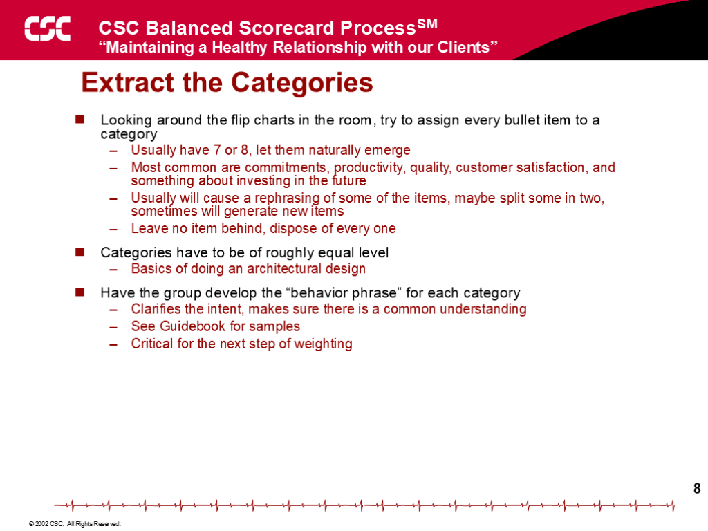

**Extract the Categories**

- Looking around the flip charts in the room, try to assign every bullet item to a category
- Usually have 7 or 8, let them naturally emerge
- Most common are commitments, productivity, quality, customer satisfaction, and something about investing in the future
- Usually will cause a rephrasing of some of the items, maybe split some in two, sometimes will generate new items
- Leave no item behind, dispose of every one
- Categories have to be of roughly equal level
- Basics of doing an architectural design
- Have the group develop the “behavior phrase” for each category
- Clarifies the intent, makes sure there is a common understanding
- See Guidebook for samples
- Critical for the next step of weighting

## Slide 9: 9

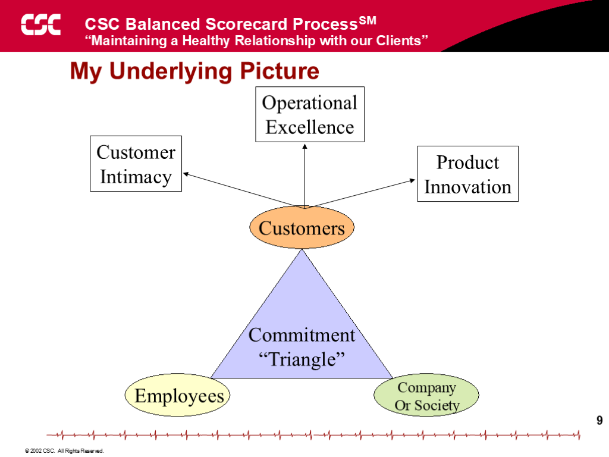

**My Underlying Picture**

- Commitment
- “Triangle”

- Employees

- Company
- Or Society

- Customers

- Customer
- Intimacy

- Operational
- Excellence

- Product
- Innovation

## Slide 10: 10

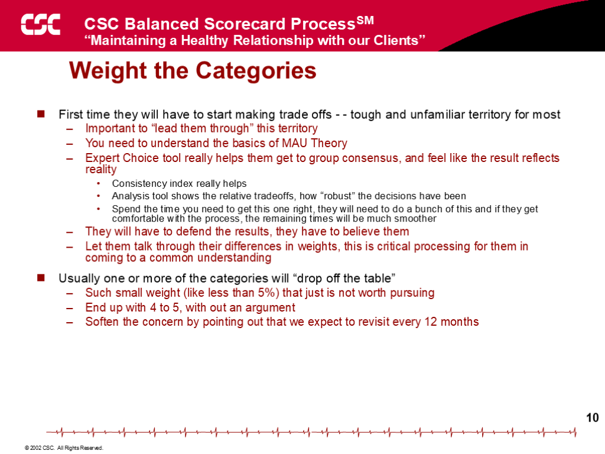

**Weight the Categories**

- First time they will have to start making trade offs - - tough and unfamiliar territory for most
- Important to “lead them through” this territory
- You need to understand the basics of MAU Theory
- Expert Choice tool really helps them get to group consensus, and feel like the result reflects reality
- Consistency index really helps
- Analysis tool shows the relative tradeoffs, how “robust” the decisions have been
- Spend the time you need to get this one right, they will need to do a bunch of this and if they get comfortable with the process, the remaining times will be much smoother
- They will have to defend the results, they have to believe them
- Let them talk through their differences in weights, this is critical processing for them in coming to a common understanding
- Usually one or more of the categories will “drop off the table”
- Such small weight (like less than 5%) that just is not worth pursuing
- End up with 4 to 5, with out an argument
- Soften the concern by pointing out that we expect to revisit every 12 months

## Slide 11: 11

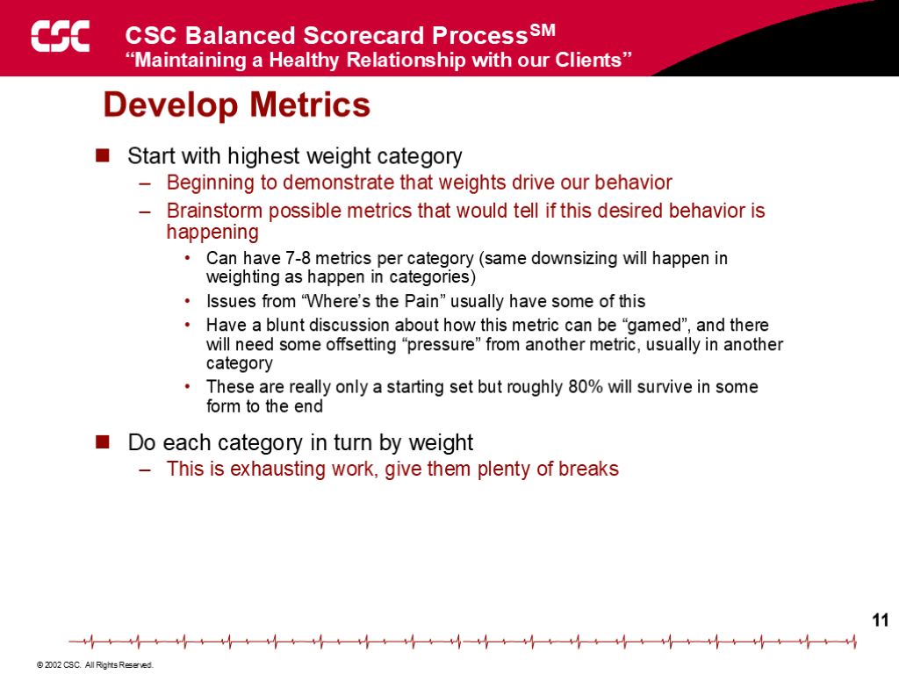

**Develop Metrics**

- Start with highest weight category
- Beginning to demonstrate that weights drive our behavior
- Brainstorm possible metrics that would tell if this desired behavior is happening
- Can have 7-8 metrics per category (same downsizing will happen in weighting as happen in categories)
- Issues from “Where’s the Pain” usually have some of this
- Have a blunt discussion about how this metric can be “gamed”, and there will need some offsetting “pressure” from another metric, usually in another category
- These are really only a starting set but roughly 80% will survive in some form to the end
- Do each category in turn by weight
- This is exhausting work, give them plenty of breaks

## Slide 12: 12

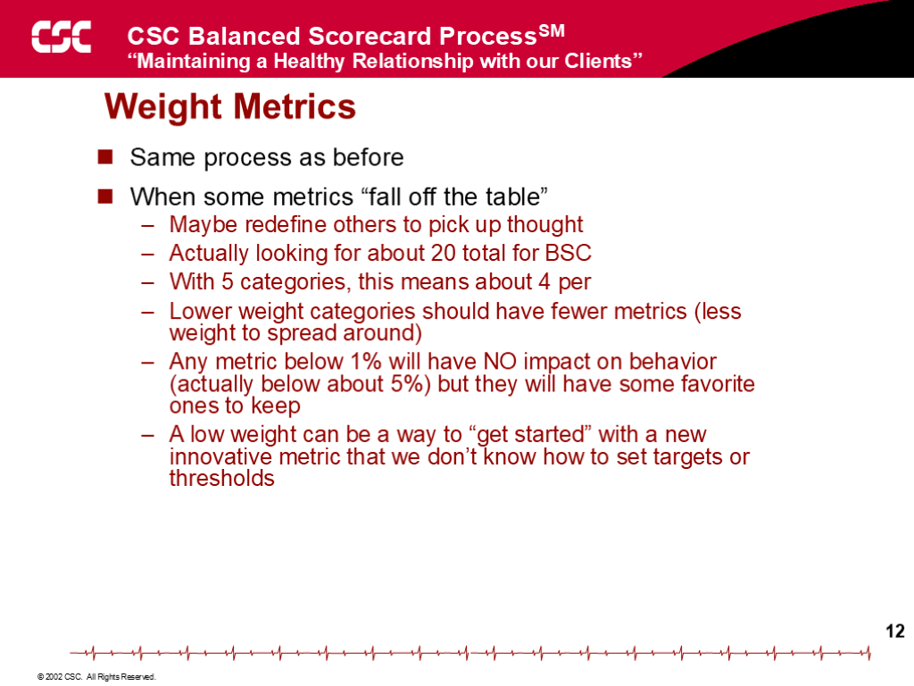

**Weight Metrics**

- Same process as before
- When some metrics “fall off the table”
- Maybe redefine others to pick up thought
- Actually looking for about 20 total for BSC
- With 5 categories, this means about 4 per
- Lower weight categories should have fewer metrics (less weight to spread around)
- Any metric below 1% will have NO impact on behavior (actually below about 5%) but they will have some favorite ones to keep
- A low weight can be a way to “get started” with a new innovative metric that we don’t know how to set targets or thresholds

## Slide 13: 13

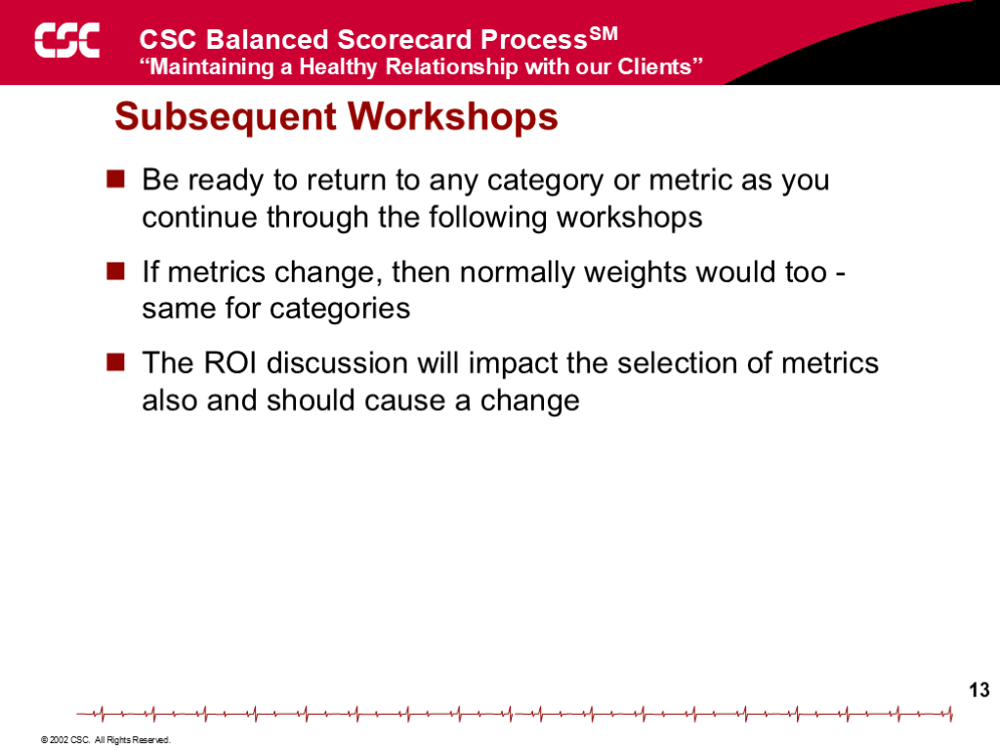

**Subsequent Workshops**

- Be ready to return to any category or metric as you continue through the following workshops
- If metrics change, then normally weights would too - same for categories
- The ROI discussion will impact the selection of metrics also and should cause a change

