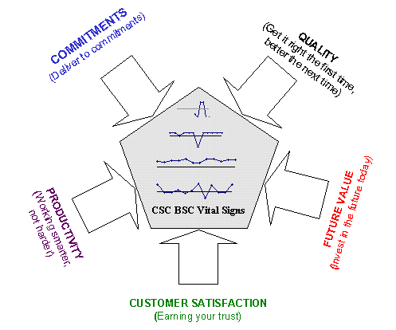
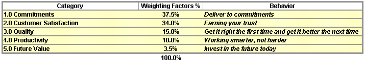
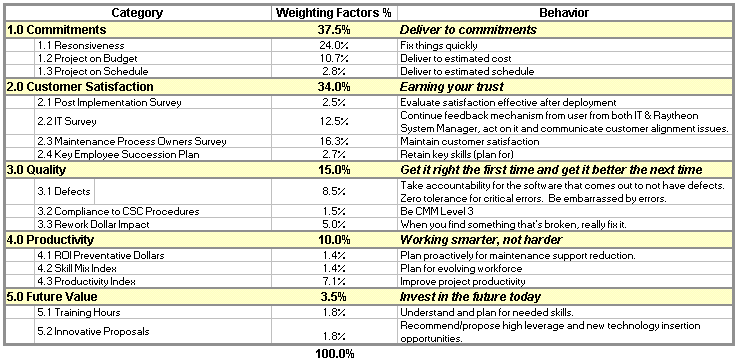
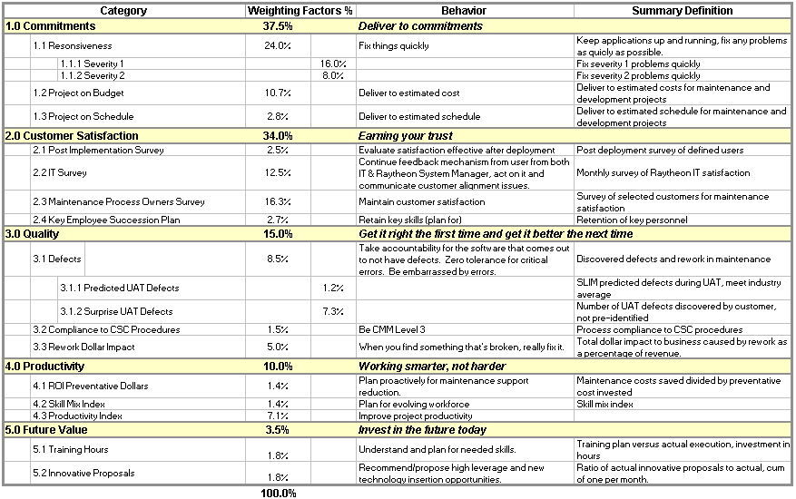
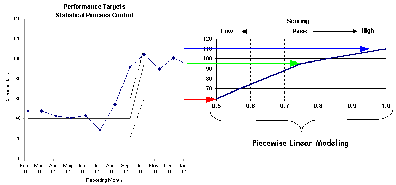
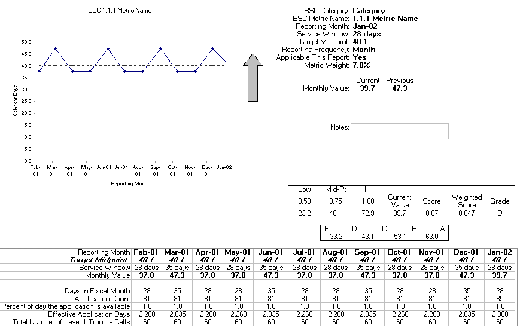
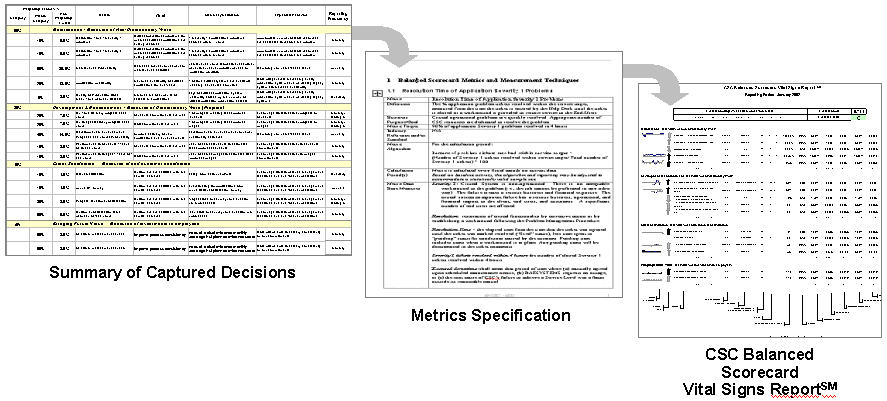
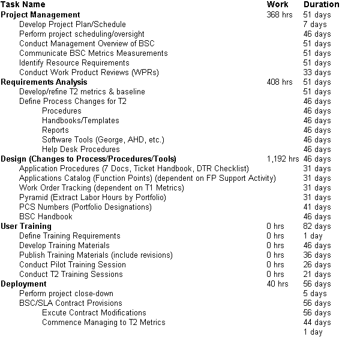
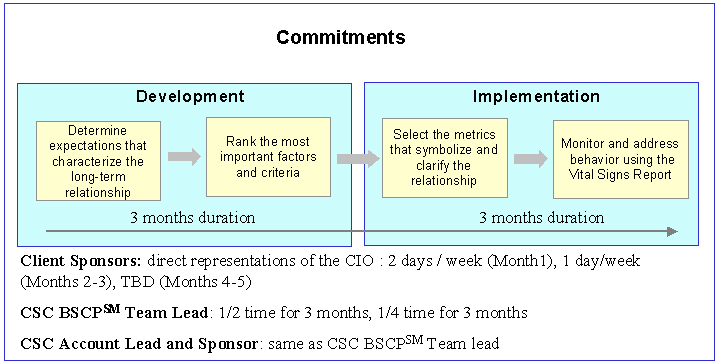

# Chapter 2: The Process

## Measuring value in client-vendor relationships

“You aren’t meeting your commitments to me.”

“We’re trying. But your priorities keep changing.”

Sound familiar? This is the symptom of a serious ailment: the loss of trust between a vendor and a client. In some cases, this ailment is caused by poor performance or the inability or failure to follow the terms of the contract. More often, though, both sides are trying to do their best. But doing your best isn’t good enough when you’re not sure what you’re expected to do.

The way to build trust into client-vendor relationships is to make sure from the start that each side knows what to expect of the other and agrees on how to measure performance. That’s hardly a new insight. Most contracts are signed by people who believe they have done just that. What we’ve discovered, however, is that clarifying goals and deciding on measurements are tasks that require a great deal more attention than has generally been recognized. These tasks require a more formal process, which we call the Balanced Scorecard Process (see sidebar).

We first developed this process to deal with issues that arose in applications outsourcing relationships. These relationships usually are initiated to achieve well-defined financial goals, but can founder because of a failure to specify operational goals. We believe this pattern is not confined to IT outsourcing, and that the process we devised to address it has much wider application.

## Where does it hurt?

Vendors are often surprised to find that their clients are unhappy even when all the industry-standard service-level agreements are being met. Vendors, and the client company’s own top management, usually attribute this discontent to a number of factors, among them the likelihood that the client’s CIO didn’t want to outsource in the first place. That may be part of the problem, but the greater part of it lies elsewhere.

The real problem is that the kinds of performance measurements that are now standard in outsourcing contracts don’t measure the right things, or at least not all of the right things. The only way to find out what should be measured is to do what should be done at the start of a contract: Ask the client’s CIO what really matters operationally.

On a contract that’s already in trouble, the vendor needs to find out where the client is feeling pain. It’s best to ask that question straight out. If you ask a more general question, such as, “What do you want?” you’re likely to get second-hand abstractions from business best-sellers about strategies, objectives, and goals. We have found the best way to get at operational level issues (strategies and goals) is to ask more down-to-earth questions: “What worries you?” “What’s going to get you fired?” “Where does it hurt?” Concrete questions elicit concrete answers.

At the beginning, this process is painful in itself. We usually do it in day-long facilitated workshops. We think of these as brainstorming sessions, but participants have compared them to day-long marriage therapy sessions. These sessions can be eye-opening to both vendors and clients because, as in marriage counseling, they bring out operational goals that never found their way into the contract.

## Weights and measures

Only by bringing out these goals can both sides discover what kind of behavior is needed to give clients what they really want and what kind of metrics are needed to drive that behavior.

The goals that come out in these sessions can be grouped into four or five categories. The categories themselves usually will be such familiar ones as financial management, quality, future value, and productivity. We try to make sure that there is very little overlap in these categories. We want to build an architecture that covers everything but in which each individual piece is distinct. In mathematical terms, we want it to be complete and orthogonal, so that when one piece changes, there are ideally no corresponding changes in the other metrics. The idea is to drive a balance of behaviors, both the vendor’s and the customer’s, to a balanced goal where the competing behaviors are “ideal” in the CIO's mind.

Although these categories are general, and so do not vary much from one client to the next, each client gives them a different interpretation and a different weight. Every unhappy client-vendor relationship is unhappy in its own way.

Vendors are most likely to be surprised by the emphasis a client gives to a category. I’ve heard vendor representatives say, “I had no idea you cared that much about that” or “You only care 5 percent about that? I spend almost half my time on it.” These sessions bring the causes of the troubled relationship into sharp focus. The vendor may be doing a good job of meeting the service levels specified in the contract, and still not be meeting the client’s needs.

The next step is to decide on metrics. It’s at this point that many clients begin to feel for the first time that they’re in control. The vendor and client representatives in these meetings are almost never the same ones who initiated and negotiated the contract; they are generally the operational management. But once the venting, categorizing, and weighting parts of the Balanced Scorecard Process are over, the client can now see to it that their goals are met by deciding on the metrics that will drive the vendor’s behavior.

Unlike most SLAs, these metrics are not pass-fail. What we do instead is devise a graded scale, then set targets and thresholds. The results are letter grades from A to F. This eliminates the SLA “give up” syndrome: “We already missed this month’s target, so we don’t have to worry about it again until next month.” Now the vendor needs to keep paying attention because the higher the score, the happier the client will be. That may sound simple, but for some people it requires an incredible mind shift

## It takes time.

Getting to this point takes from one to three months. Implementing the metrics and making final decisions on how to report them can take another three to six months. The results are well worth the time invested.

The results to date have been so beneficial that we have begun to apply the Balanced Scorecard Process at the beginning of contracts. Here, too, it takes place after the contract has been signed. The difference is that the contract was negotiated with the understanding that operational goals would be determined soon after signing.

Because the contract has yet to get underway, the workshops are less painful and the questions are different. The questions are not about the past but about the future: “What’s most urgent?” “What do you have to do in the next 12 months?” “What do you want to do?” Again, we elicit goals that were not spelled out in the contract. And we face the constraints of that contract up front. The CIO knows she won’t get everything she wants, but she is the one who decides -- through categories, weights, and metrics -- how to shape the vendor’s behavior within the terms of the contract. Pain can’t be avoided entirely, but this way it won’t come as a surprise.

### Sidebar: Using the best tools

The Balanced Scorecard Process (BSCP) borrows the term from the book by Robert S. Kaplan and David P. Norton, but it didn’t start there. Kaplan and Norton were trying to persuade CEOs to rethink their strategies and objectives by balancing financial measurements with other business perspectives. The BSCP started lower down, and grew out of attempts to combine industry-standard service-level agreements with other metrics to achieve more balanced measures of performance on service contracts.

Only gradually, after several contracts’ worth of experience, did we realize both that achieving this balance required a formal process, and that we already had made considerable progress toward developing a process. By this time, we had combined traditional metrics with several tools and techniques. Among these are: the Software Engineering Institute’s Goal Question Metric process, to extract desired goals and metrics; and Thomas L. Saaty’s Analytic Hierarchy Process, to add weights to the chosen metrics and to align contract requirements with organizational goals.

(160w)

### Sidebar: Vital Signs Report

Caption: The result of the balanced scorecard process is the one-page Vital Signs Report. In the hypothetical report above, the spark line graph on the left shows the trend in vendor performance for the work described in the Metric column. The gray line is the target, and the gray arrows indicate whether the spark line should be above or below the target line. The Target column gives the targets as percentages -- deliveries should be made on time and on budget 80 percent of the time -- and the Actuals column gives the actual performance. The Weighting Factor indicates how important each metric is on the overall scorecard. The final score, 0.894, is obtained by adding category scores in the last column. As indicated by the grade conversion scale on the top of the report, this score means a grade of B for the reporting period.

Pull quotes:

Doing your best isn’t good enough when you’re not sure what you’re expected to do.

Industry standard performance measurements don’t measure the right things, or at least not all of the right things.

Every unhappy client-vendor relationship is unhappy in its own way.

Vendors can meet the service levels specified in the contract, and still not meet the client’s needs.

# Development of a BSC

## Overview

A common problem faced on accounts is finding a way to measure the firm’s performance and drive organizational behavior to meet our clients' goals over time as changes occur. The Balanced Scorecard Process (BSCP) is an evolutionary process to solve that problem. The BSCP integrates disparate principles, tools, and techniques into a mechanism to measure and report account goals and objectives. The BSCP integrates organizational change, statistical methods, and innovative metrics into a repeatable, practitioner independent process demonstrating the firm's metrics and process maturity - a competitive differentiation. It also incorporates a feedback mechanism to keep the client’s goals current.

A BSC is developed by a series of facilitated workshops, over a period of weeks and months. These workshops are generally two days long, once a week, which allows time for "homework" to occur. The participants are both the client and the firm account personnel.

The start of the process is usually a management meeting with the firm and client senior managers. This may be for instance the the firm's Account Executive and the client CIO. This meeting is about getting the expectations clear for what the BSC is and is not, a tentative schedule (need to get the team together to make sure this is acceptable), and to get the right team membership from the customer. Since the basic intent of the BSCP is to "extract" and make visible what the CIO (or equivalent) cares about, so we can drive our organizational behavior, it is critical that the customer team representatives are adequate surrogates of the CIO and there by the client's views and concerns. If those representatives are not adequately aligned or in the know, then the team will make decisions that are never agreed to by Sr. Management and will not drive the the firm account to the right goals.

Don't leave this meeting, or at least don't start spending time with the team until you are satisfied with the ability of the client to represent the organizational and CIO level concerns.

The development process occurs in three phases that produce a series of releases of the BSC. These phases interact but have reasonably clear exit points.

### Phase One

Establishes the framework, priorities, and defines the initial set of metrics. It should take approximately 4 weeks, with a 2-day meeting each week, and with time between meetings to work on action items.

The output of Phase One is a management briefing that provides initial approval of the metrics, weights, and "go forward" plans. It includes:

- goals
- behaviors
- high level definitions of the metrics
- ROI for each metric
- an initial phasing plan for deployment (to get to a "first operation" milestone)

### Phase Two

Approximately two months long, with meetings each week, and its goal is to get to the first release of the BSC and its definitions. The first release should cover at least half of the total BSC weights and touch as many of the categories as possible.

### Phase Three

Generally about three months long, with meetings initially every other week, to complete the remaining releases of the BSC. The second release covers metrics that needed a tool change but little or no process change. The third release generally covers metrics that are hard to implement. They could require new definitions and process changes or they could need an external tool or system to change.

In the process described below, existing historical account data is used to set targets and thresholds. A new account may have to set these using the firm or industry data.Conduct Management Briefing

## Determine Expectations

The first meeting (the Sponsorship Workshop) is basically a facilitated series of discussions, typically with the CIO. This is intended to confirm the general SOW for conducting this engagement: the goals of the BSCP process, the high-level process that will be followed, the constraints, assumptions and preliminary plans/schedules.

Use flip charts to capture the discussion points. Be sure to have a recorder who will publish minutes from each meeting. Recording the flip charts can be sufficient, if the flip charts are well done and reasonably complete. Decisions will need to be referenced in future meetings. It is useful to actually date and number each flip, because later the group will want to go back and ask the reason they made a decision. Keeping this "history" in a referential form for each subsequent meeting can be very helpful. The first objective is to define the following:

- Goals
- Requirements
- Acceptance criteria
- Terms of Reference
- Scope
- Constraints
- Stakeholders
- Decision points that will be presented for CIO approval

This first meeting is also a test to see if this initiative should proceed. Expect that the CIO should

- Be able to articulate the business case for spending all the necessary effort on this project
- Demonstrate clear sponsorship for this initiative
- Appoint suitable surrogate(s) for him/herself: senior enough to understand the business issues, yet close enough to the day-to-day action to determine what is workable. (Calibrate this nomination with the delivery team).

Also check the commitment of the delivery team themselves: are they willing to commit the resources to see these activities through?

Use the Accelerating Change artifacts

This Sponsorship Workshop is then followed (immediately, or soon after) by a Status Workshop. This typically takes a couple of hours, and looks at setting the expectations for how the team will work:

- How are we going to work together?
- What is the end point?
- What are the acceptance criteria?
- Etc.

Make sure that all the key client and the firm stakeholders (e.g. CFO, Contracts) are represented, or are involved via a tight feedback path.

*Facilitator led the meeting and presented an overall agenda for the day:*

- *Goal*
  - *Problem to solve*
  - *Identify stakeholders*
  - *Review sample output*
- *Scope (define terms of reference)*
  - *How we operate*
- *Process*
  - *Goal Question Metric*

*Facilitator explained the process would take 4 – 5 meetings, spaced 1 week apart. The next meeting will be a 2-day workshop.*

*The group reviewed the sample output from a generic Client account. We reviewed several factors and measures used at this account. In reviewing this information, several comments were made:*

- *Measures typically cost $500 - $1,000/year*
- *We will be working toward deriving a minimal set of measures. This sample may be a good model for us to start*

*After reviewing the sample we defined the following:*

*Goal for Group*

*Provide a framework to manage Application Service’s performance to meet
Client expectations*

*Problem*

*Incorrect measures in place to Application Services*

*Goals for Working Group*

- *Develop working prototype to present to management for their approval*
- *Define next steps*
- *List of contract issues and other issues*

*Working Prototype Requirements*

- *Cover all stakeholder interest*
  - *Comprehensive, flexible, holistic, totality of Application Services*
- *Consistency*
- *Minimize effort to implement, operate*
- *Linkage between goals to metrics explicit (management friendly)*
- *Aggregate results*
- *Reflect explicit priorities*
- *Working at CTO level*
  - *Real data and sample data*
- *Test with group data (real & simulated)*

*Stakeholders are defined to be:*

*the firm Client Union Departments Auditors*

*Group Financial Officers Legal Contract Review Committee Purchasing*

*Constraints & Assumptions*

1. *No contract negotiations*
2. *Cost ramifications (see #1)*
3. *Target ~15 measures*

*Group Terms of Reference (Simple charter for adhoc working group)*

- *Core group (it is key that the same people participate from day 1 through the entire process)*
- *Weekly Meetings, 2 contiguous days, face-to-face for 3 – 4 weeks*
- *Product within 4 weeks*
- *Homework*
- *Consensus driven*
- *Minutes – email group, conference call/Net meeting if possible*

## Brainstorm session - "Where's the pain?" seminar

The next step is a facilitated, face to face brainstorming session to get to root causes and desired behaviors. The client representatives (typically the CIO surrogate plus 1-3 others) are now encouraged to talk and the the firm Account team briefed to listen (and be amazed).The session starts with questions like, "Where's the pain in our support right now", if it is an ongoing account or "Where is the pain in the current delivery of services?" if this is a newly started account. These issues will dominate their thinking and root causes have to be exposed to measurement or the expected behavior will not deliver the payoff needed. By starting with pain, the discussion gets real very quickly. Following these questions with "So what are you trying to achieve?" type of questions will be rooted in the frank discussion, and help get to fundamental issues for measurement.

Workshop tips:

- A neutral facilitator is essential, and also a separate scribe
- If you are using flip charts to capture this discussion (note that there are other methods to accomplish this goal), post around the room as you go. Prepare for 35-40 flipcharts - you might need to get a bigger room eventually but it is important to have all the points displayed as you go.
- Ask “why” five times, to get them to uncover root causes.
- It may take a whole day before starting the categorisation.
- This is a high-energy event, stressful for all.
- Use questions to keep the ideas flowing:
- “if you had a magic wand …”
- “what do you hear your boss complaining about?”
- “how do you get measured?”

## Category Grouping

When the group finally runs out of energy, or time, then is the time to try and organize the bullet points into categories. Generally this ends up being some fairly obvious ones like "commitments", productivity, quality, customer satisfaction, etc. Also there tend to be a few "outliers" that can be grouped as a cats and dogs. It is useful to start fresh flips to do this because you can consolidate the ideas, boil down the essence of the issue, refine it, etc as you go. This is a very dynamic process and very interactive, with the account and client representatives coming into a common understanding of the open issues and desired outcomes. Normally there will be 5 or 6 categories with multiple sub issues that in essence define what that category title is about. More categories are OK, the weighting process will cause a refinement. Often this is the first time the customer has clearly articulated all the frustration and pain in a very clear way. This is one reason the BSCP team lead should be from outside the account, they do not have the personal investment and can stay objective.

The objective of the categories is to be complete and orthogonal, i.e. to cover all the areas but for each category to be distinct from the others. This will help with having metrics that have the same characteristic.

Workshop tips:

- Check to make sure all the brainstorming points have been visibly placed into one of the resultant categories.
- It helps to keep an issue "Parking Lot" on the side.

*Issue Parking Lot*

- *Is there a budget cycle driver?*
- Categorisation may cause a rephrasing of some points, and maybe split some between two categories

### Category Description

Then spend the time for each category to define a phrase that captures the essence of the category. These “behavior phrases will ensure that there is a common understanding

- For the CIO
- For the whole the firm Account team
- And to be used for the following stages of this process.

Question: I am confused if this is an instruction to produce descriptive phrases here, separately from the phrases derived in about 4 pages time (“The next step is to have a short discussion …”). Reckon that this should be clarified … ?

See samples below.

- Commitments – Deliver to commitments
- Productivity – Working smarter, not harder
- Quality – Get it right the first time, better the next time
- Customer Satisfaction – Earning your trust
- Future Value – Invest in the future today

*The facilitator led the meeting and presented an overall agenda:*

- *Walk thru last weeks minutes*
- *Goals*
  - *Define categories*
  - *Define behaviors*
    - *the firm*
    - *Client*
  - *Hopes, fears, wishes, dreams*
  - *Criteria*
  - *Down select (5 or 6) definitions*
  - *Determine priority weighting*
- *Go deep in to one category as a test case*
- *Do all*
- *Homework*

*The meeting schedule was set for the next two weeks as:*

|  |  |  |  |  |
| --- | --- | --- | --- | --- |
| *Monday* | *Tuesday* | *Wednesday* | *Thursday* | *Friday* |
| *4/2*  *12 – 5* | *4/3*  *8 – 5* | *4/4*  *8 – 12* | *4/5* | *4/6* |
| *4/9* | *4/10* | *4/11* | *4/12*  *8 – 5* | *4/13*  *9 - 12* |

*The group came up with the following categories:*

*Goals/Categories*

1. *Commitment*

*Schedule, budget, functionality*

1. *Client Satisfaction*

*Expectations, caring*

1. *Innovation
   BPR
   Headline test (fame & glory), bring best practices*

Merge

1. *Productivity
   Something for every $, are we getting better*
2. *State of the Artness
   World class IT shop, process, tools
   WEB based*
3. *Quality
   Defect
   MTBF, MTTR*

Merge

1. *Employees (the firm)
   Morale, good place to work, attrition
   Key employee retention, training*
2. *Save Money
   Get more product for $, reduce application instances
   Bring ACRB at budget*

Once the categories are organized, start a process to get a series of bullets that define what this category means from a behavioral view, for both the the firm and client targets groups. This should have 3 or 4 bullets for each group for each category. It is important to get this definitional base established or the weighting exercise that follows won't be tied to a common understanding.

***Commitments (Behaviors)***

- *No sticker shock (high estimates)*
- *Schedules not aggressive*
  - *Both more realistic and aggressive schedules*
  - *Same for budget*
- *Performance meets estimate. No surprises on schedule & budget*
- *Exceeds functional requirements (better ideas), better dialog or trade offs*
- *Mutual agreement about status of estimate (ROM, FFP, ….)*
  - *Could cause process change/improvement*
- *Commitment to non-discretionary budget*

*Client*

- *Users do SR instead of WO (piecemeal requests)*
- *Send requests with out real requirements*
- *Need to understand contract & constraints*
- *Need to understand the process*

***Client Satisfaction (Behaviors)***

- *Happy Client (end result)*
  - *Flexibility, teamwork
    Part of process (non throw over wall) [variable by group]*
  - *Do you care about problem, good interaction*
  - *High approval rate & shorter approval cycle time*
  - *Traceability to business plans & business metrics*
    - *Directly traceable to achieve business objective*
- *More of partner versus vendor*
- *Degree to which Client relies on the firm, $ sent to other vendors*
- *Stability of face of people*
- *Use to certain SME retention*
- *Degree to people wanting to be involved (ERP, Apps …)*

*Client*

- *Articulate expectations & beyond*
- *Provide constructive feedback*

The next step is to have a short discussion on the criteria in order to create a one-sentence definition of the desired behavior for each chosen category. The results will be something like:

- Impact on client business operations
- Impact on costs
- External perceptions of the client users
- Scope of impact this area can have
- Ability to change or leverage available for this category

Next create a one-page summary of the category name and with the one-sentence desired behavior sentence.

***Criteria for behavior***

- *Impact on Client business operations*
- *Impact on cost to Client*
- *External perception of Client*
- *Ability to affect change in factor areas*
- *Scope of impact*

***Definitions***

- *Commitments*

*I trust the the firm to develop, communicate, & implement realistic expectations about applications*

- *Customer Satisfaction
  Happy with relationship & results – earning your trust*
- *Innovation, Future Value
  Leading edge technology to enable creative business solutions, invest in the future today*
- *Productivity
  Efficiency and maximizing the Client ROI; work smarter, not harder*
- *Quality
  Quality processes that make it right the first time and better the next time*

### Weight the Categories

The data from this exercise is then entered into the Expert Choice tool, which will be used to assign weights to the categories. The BSCP team lead will need to explain the theory behind the process so there is some trust that the weighting exercise results are valid. In particular, the consistency index is important. This may typically take 30 mins, using the demo AHP presentation. It is important that they understand the basics of this method and are comfortable with it, as it will be used repeatedly over the steps ahead.

Using Saaty’s method to assign weights to categories, the results look like the following example:

|  |  |
| --- | --- |
| **Category** | **Weight** |
| Commitments | .375 |
| Customer Satisfaction | .340 |
| Future Value | .035 |
| Productivity | .100 |
| Quality | .150 |

The group process using the tool is very dynamic. The client representatives are the only ones to vote on ranking. It is critical that the result reflects their concerns and priorities. The Expert Choice tool helps them (with the use of the consistency index) to converge on a common weighting. First instruct the representatives to not just agree with the rest of the group or to just go along. Here is where differences in understanding of what is being decided will surface. This has to happen and talking it through should be encouraged. At the same time it helps to have a senior member of the client who can move forward if necessary. This is all a delicate balance. It is worth the time to help them discuss the why behind each vote. Capture any changes to the issues and phrase as a clearer understanding surfaces.

This process will start making trade-offs between the categories, and some may drop off the list. For (say) 7 categories, allow 3-4 hours to go through all the pairwise comparisons.

The BSC Decision Matrix can now be filled in at a high-level using the data developed from the various process steps.

### Select metrics that drive behavior

The next step involves the beginning development of the metrics within each category. The goal is to get to 4 or 5 metrics for each category, which results in approximately 20 total metrics. Each metric should be developed so that it will drive the behaviors desired and meet the ROI criteria. Each category is explored with a facilitated brainstorming session (client participation only) to get the metrics proposed and a brief definition, mostly in bullet form. Brainstorm all the categories and then move the metrics around as necessary to be in the right category. This may result in eliminating a category. Keep the focus on a key issue, remembering that the category name is only a label. When the possible metrics are put forth, the definitions may need to be updated. Any holes or overlaps should be initially addressed here.

There are tensions here:

- The client wants metrics that will change the firm behavior and thus address the “pain”
- The the firm Account team wants to include only those metrics that the firm is already measuring
- The the firm Account team wants to include only those metrics that the firm can easily pass

These metrics may require new work habits not clearly specified in the existing contract scope – these issues will need to be addressed. The guiding rule should be to aim for “what is right”.

*Quality (Metrics)*

*Code Quality*

*Abends/K steps*

*Error SRs in the 1st 90 days of release in production (RCA)*

*Errors (SRs/FPs)*

*Rework*

*Hrs rework/actual hrs*

*Availability*

The team down selected these metrics. The grayed text identifies which were eliminated.

*Apps downtime as proven by Root Cause Analysis*

Merge

*Time to Restore (MTTR)*

*Current MASL (explore)*

*Readiness for Prime Time (applies to new projects/major releases)*

*# of help desk calls after implementation*

*# of help desk calls solved the 1st time*

*User training (survey)*

*Functionality Completeness*

*Exit interview/survey w/user (subjective, team had issue with this one)*

*Visibility in to estimating detail*

*Client satisfaction on approval rate*

*End user documentation/training quality*

### Weight the metrics

Once the individual metrics are created within each category, then the weighting for the metrics within the category is done, again with the Expert Choice tool. Once the weights are assigned, some metrics may be eliminated because they are just too low in priority, like 1 or 2 %. Some low weight metrics might be combined into one metric and you might also split a metric that is very large into two metrics.

#### Sample weighting results

|  |  |
| --- | --- |
| ***Quality*** | |
| ***Metric*** | ***Weight*** |
| *Defects* | *.085* |
| *Compliance to the firm procedures* | *.015* |
| *Rework Dollar Impact* | *.050* |
| ***Commitments*** | |
| *Responsiveness* | *.240* |
| *Budget* | *.107* |
| *Schedule* | *.028* |
| ***Productivity*** | |
| *ROI Preventative Dollars* | *.014* |
| *Skill Mix Index* | *.014* |
| *Productivity Index* | *.071* |
| ***Future Value*** | |
| *Training Hours* | *.0175* |
| *Innovative Proposals* | *.0175* |
| ***Customer Satisfaction*** | |
| *Post Implementation Survey* | *.025* |
| *IT Survey* | *.125* |
| *Maintenance Process Owners Survey* | *.163* |
| *Key Employee Succession Plan* | *.027* |

After the weights have been assigned and the metrics reviewed, go back and recheck the definitions. The goal is to get balance, which means the metrics should be complete in coverage, and as orthogonal (least overlap) as possible.

This is an exhausting process; the client is making lots of decisions in the presence of uncertainty and making tradeoffs they have not had to do before. The client will need to validate their decisions with their executive sponsors, usually the CIO and other stakeholders.

This is a particularly important time to be able to check in with the stakeholders. It is necessary to allow enough time to let these conversations occur and "soak in". If the set of decisions to date is not heading in the right direction, the next meetings will be wasted effort.

You should have spent about 4 days at this point in meetings and about that much time completing "homework” dispersed a three-week time period.

The BSC Decision Matrix can now be expanded using the data developed from the various process steps.

### The agenda for the next set of decisions:

1. Review/revise metrics
2. Priority/weights

Face to face

1. Define parallel efforts on “very sure” metrics
   - 1. Next steps on non-very sure metrics
2. Spreadsheet/thresholds
3. Impact
   - 1. Effort analysis
     2. Definition sheets
     3. Tool build
     4. Insert existing data into prototype

Parallel efforts

1. Build management brief
   - 1. Management
     2. Contract recommendations
     3. Implement
     4. Schedule w/ management
2. Socialize – Client
3. Homework

The metrics are revised based on any feedback from the stakeholders and re-weighted as necessary. Each metric is examined to see if it needs to be driven down a level and broken into sub metrics. In general this will happen to about half of the metrics. Again they need to be weighted as sub-metrics.

In this process, the number of metrics under consideration first expands and then starts to drop. This is necessary to make sure there are a wide set of possibilities that can give the balance needed. If there are 20 metrics total, then the average weight of each metric will be 5%. Since they are not all of equal importance, some will be in the 1% range and some will be in the 10% range.

After the metrics begin to settle down, it is time to stand back and do some internal cross checking. Ask questions like, "Is this 10% on productivity really as important as this 10% on defect density?". The client team members have to be ready to defend their choices when there is pushback from others. This will be important to the sponsors, who will have to drive the behavior change on the client side.

The next step is to fill in the full BSC Decision Matrix with everything decided to date, including the ROI information. These are based on estimating the implementation and operational costs in terms of low, medium, or high and then qualitatively doing a comparison with the weight of each metric. In general, the metric weights tend to be spread out from a few percent up to the 10% range. However the implementation and operation costs should affect the ration and this will quickly show which metrics may be too costly or too difficult to implement. They might need to be eliminated or replaced with lower cost, easier to implement metrics.

After these activities, an output management briefing can be generated. It should include the spreadsheet and some of the rational for choosing the categories and metrics. An implementation schedule and open residual issues for management decision should also be presented.

This is a very important management go/no go decision to invest in the rest of the cost of implementing the BSC.

It normally is a lively discussion, taking up to 3 hours. If any part of the metrics and approach are a surprise to management then it will take longer. This is one of the reasons for the intervening time for "homework", so that management will not be surprised.

## Scoring and setting ranges

### Deriving Baselines

The following methods are used to derive baselines for each metric. The method to use is indicated in the specification document for each metric.

#### Historical Average

- Create a control chart for the metric.
- Decide on the baseline data. This may be the entire range or the latter portion if a stable process has been identified.
- Use the average as the 75% credit point (baseline) – center of C range
- Assign the control limits to the 50% and 100% range for scoring purposes

#### Modified Historical Average

- Create a control chart for the metric.
- Decide on the baseline data. This may be the entire range or the latter portion if a stable process has been identified.
- Use the average as the 75% credit point (baseline) – center of C range
- Adjust Upper and Lower Control Limits to current SLA, MASL and/or Industry Data
- Assign the control limits to the 50% and 100% range for scoring purposes

#### Industry Experience

- Analyze historical data
- Consider industry experience and desired behavior on applications
- Develop scoring framework based on proposed thresholds for scoring curve

#### Surveys

- Use the average of the highest and lowest possible survey score as the 75% credit point – center of C range
- Assign the control limits to the maximum and minimum survey values.

## Specification Sheets

### Template

Each the firm Balanced Scorecard metric will be defined as prescribed below.

|  |  |
| --- | --- |
| Metric | *Name of the metric* |
| Definition | *Textual description of the metric* |
| Business Purpose/ Goal | *Underlying factors that drive the metric towards a desirable level* |
| Metric Target | *The metric target score…(Define the metric)* |
| Industry Reference and/or Standard | *External data on the common values found in the technology development industry for each measure. Note: N/A indicates Not Applicable.* |
| Metric Algorithm | *Formula to calculate the metric*  *(The metric is calculated [show algorithm] for the time interval for which the base measures are collected and combined. Examples: base measure A for status month is divided by base measure B of status month; rolling 12 month; calendar quarter* |
| Calculation Period(s) | *Frequency with which this metric is calculated* |
| Metric Data Base Measures | *Component A of the metric is…*  *Component B of the metric is…*  *Inclusions: list any data components included in metric calculation*  *Exclusions: list any data components excluded in metric calculation*  *References for details if applicable are…* |
| Data Generation | *Base measures are created by …(Describe who, what, where, when, how base measures are created. Examples: Help Desk agent enters ticker, Project Manager enters data in the metrics repository.)* |
| Data Collection | *Base measures are collected …(Describe who, what, where, when, how Base Measures are collected. Examples: Applications Support updates problem ticket, Project Manager enters data into metrics repository.)* |
| Data Storage | *Base measures are stored …(Describe who, what, where, when, how based measures are stored. Examples: metrics repository, time accounting system, billing system, etc.)* |
| Report | *Metric is prepared for reporting.* |
| Reporting Frequency | *Frequency with which this metric is reported* |
| Aggregation Rules and Example | *Metric is aggregated at the account, business group level.* |
| Scoring Rules, Weights and Scoring Frequency | *Indicate the rules for scoring the metric, its weight and how often it is scored.* |
| Baseline Process | *Indicate which baseline process was used to derive the process limits.* |

### Principles

If a metric has no data in a calculation period, set the column ‘**Applicable This Report**’ to “**No**” in the Balanced Scorecard Report. The metric is dealt with as not active and its weights are redistributed over the scorecard.

Scoring is at the account level based on account level baselines.

Projects are considered to be equal from a scoring standpoint. Every metric that aggregates project data will calculate the individual project metric and then average the value for an overall score for the scoring period.

Quarterly Metrics: The default score for the first 2 months of managing the scorecard will be a C. Thereafter, the scoring will be quarterly based on the previous 3 months and the score will carry forward the subsequent 2 months.

!!! note "Figure 6 — Scoring scale schematic"
    *Original figure exported from Word as a vector graphic (WMF) that does not display in web browsers. A web-format version is being prepared for a future revision. The figure illustrates the scoring scale: control limits at 50% and 100%, baseline (average) at 75%, with letter-grade ranges of A through F mapped across the percentage range.*

## the firm Balanced Scorecard

The the firm Balanced Scorecard has a minimum of 2 different tabs, one for the summary presentation of all the metrics as the scorecard (Vital Signs) and one each for the individual metrics.

### Sample BSC Report

!!! note "Figure 7 — Sample BSC Report"
    *Original Vital Signs Report figure exported from Word as a vector graphic (EMF) that does not display in web browsers. A web-format version is being prepared for a future revision. The figure shows the one-page summary report described in Chapter 1: a spark-line graph per metric, target and actual values, weighting factors per category, and the overall letter-grade score for the reporting period.*

### Sample Metric Tab

Each metric has its own tab in the BSC where all the detail data is entered, calculated and presented.

## Work Product Summary

In summary, the process flow creates the following work products in the order shown. The process is iterative, so you need to keep the documents current with each other.

# Implementation

## Implementation Phasing

Some metrics are “ready-to-go” and can be captured with little or no change to the processes and others will require changes to processes, tools, and capture methods before they can be reported. The existing metrics, and those requiring minimal changes, will comprise the set reported in the first BSC release, typically labeled T0 (Time Zero). They will bear the brunt of the training and organizational change activities. It is important to get as much weight into the first release as possible; over 50% is an important threshold and a metric from each of the categories should be included if possible.

Document the current set of decisions in the BSC Decision Matrix and into an executive management briefing. It is a key time to check back in with both management chains to make sure everything is in sync with their expectations.

After the management approval to proceed the focus of the work is on details around target and threshold setting. The specification document and the BSC report will be the products for the next work phase.

There are a number of deployment issues that are true about any organizational change. These are not discussed in this document. It is recommended that you use the Accelerating Change tool set and conduct training for the deployment team in Accelerating Change tools and techniques. Only those things that are focused on deploying a BSC for full operation are discussed here.

## Preparation

If the BSC is being deployed in a new account during transition, the amount of other changes going on will make it hard to get things to "stick". Our experience in transitioning new accounts is that they are all Level 1 organizations, used to “firefighting” and dependent on heroes. The amount of new material and new relationships that are in process gives a very large "noise" factor that tends to absorb the necessary attention bandwidth in managers and will get drowned out by operational urgencies of the day to day events.

If being deployed in an existing account this transition noise is much reduced.

### Sample Implementation WBS

This covers the implementation tasks for phase T2 only.

# Operation

Operation of a BSC is dependent on the skill set of the metrics lead and continual sponsorship by the Delivery Manager. The metrics lead skills are discussed in the the firm's metrics handbook.

## Processes for operation

Account-specific Desk Instructions are required for the operation of a BSC, since the collection and validation of the metrics data, and the report production are tied to the set of account-specific tools and tailored spreadsheets.

## Estimating effort and schedule to produce each BSC

The following are taken from our experience across several implementations to date.

## Tools to support collection and analysis

We have a standard spreadsheet we use to produce and report the BSC. It is then tailored to reflect the metrics defined in the account contract.

## Review

### Guidelines for Re-Baselining

Discussions between the client and the firm regarding re-baselining the the firm Balanced Scorecard will have two primary triggers:

1. Annual contract review, as specified in the Agreement
2. Event-based triggers, as follows:

Test 1: A single point falls outside the 3- sigma control limits.

Test 2: At least two of three successive values fall on the same side of, and more than two sigma units away from, the center line.

Test 3: At least four out of five successive values fall on the same side of, and more than one sigma unit away from, the center line.

Test 4: At least eight successive values fall on the same side of the centerline.

Source: SEI briefing, using a Western Electric Handbook source.

### Seismic Event

An application-related ‘seismic event’ is an action which has a significant impact on the Client application portfolio, such that (based on projections mutually agreed upon by the Client and the firm) performance statistics will likely be generated that fall beyond the 3-Sigma range from the metric ‘C’ target for a particular Balanced Scorecard metric (or set of metrics). See Appendix A, Seismic Event for a full discussion.

### Scoring Methodology

the firm Balanced Scorecard measurements are computed in accordance with the BSC Metrics Definitions document to produce a “current value” for each metric. The “current value” is converted to a letter score by interpolating its corresponding percentage score from the established base-line target and standard deviation thresholds, which is unique to each metric. See Appendix B, Scoring Methodology for an example.

### Annual Re-baselining

Annual re-baselining is an event where the current metric targets will be re-evaluated to determine if new thresholds should be set for A – F grade for the following contract year. It is expected this event will take place the month before the last month of the current contract year and be concluded before the contract year is completed. See Appendix C, Annual Re-baselining for a full discussion of the steps involved.

### Improvement Rules

The expectation is that annual improvement targets will be set based on selected metrics from the BSC with the overall purpose of incentivizing improvement from the prior year baseline. The general form of this target follows the BSC form, selected metrics are weighted by importance with the weights adding up to 100%. The target is met if the selected metrics, by weight, i.e. the “Improvement BSC” shows at least a mutually agreed to improvement from the prior year. See Appendix D, Improvement Rules for a full discussion.