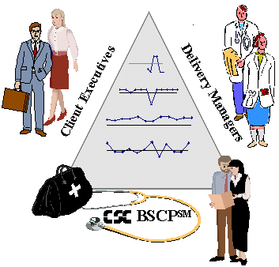

# Chapter 4: Implementation Guidance

!!! warning "Partial draft — chapter in development"
    This chapter is partially drafted. The "Roles and Required Skill Set" section below is complete. The remaining sections — particularly the "Letter to My Younger Self" section on what I wish I had known starting out — are in development and will be added in future revisions. Reader contributions are welcome via the [contributing guide](about/contributing.md).

This chapter deals with what you need to know and do to make the Balanced Scorecard Process work in practice.

## Roles and Required Skill Set

The following describes the skill sets needed across the development process. If these basic skill sets are not present, the working group developing the BSC can cycle through multiple sets of metrics and trade-offs, using too much time and risking failure to reach closure.

### Client executives on the team

As members of the team, the client team members need:

- To be high enough in the organizational structure to be a good analogue for what the CIO wants to accomplish, including contract tangibles and client-satisfaction value for the CIO's business users
- Insight into the contract
- A good understanding of how processes both currently work and how they should work on the client side of the relationship
- Knowledge of what will be acceptable to the users that interface with the consulting firm's processes, in terms of process changes that need to happen
- To be willing sponsors or champions of the proposed and necessary changes
- To be able to make decisions and commit to them

### Delivery managers on the team

As members of the team, the account team members need:

- To be high enough in the organizational structure to be a good analogue for what the Account Executive wants to accomplish, including contract tangibles and client-satisfaction value for the AE's business users
- Insight into the contract
- A good understanding of how processes both currently work and how they should work on the client side of the relationship
- Knowledge of what will be acceptable to the users that interface with the firm's processes, in terms of process changes that need to happen
- To be willing sponsors or champions of the proposed and necessary changes
- To be able to make decisions and commit to them
- To be prepared to listen to the client representatives

### The BSCP team itself

Team members should be comprised of metrics analysts, process experts, and experts in the use of the tools on the account.

**The BSCP team lead** needs:

- A good grasp of metrics theory and practice, especially of the firm's metrics program. The metrics that are incorporated into the firm's standard processes are relatively inexpensive metrics, since there is no extra cost when the processes are followed. By getting as many of the standard metrics into the BSC as possible, the standard processes are reinforced.
- To be a skilled facilitator and a good listener
- To understand the basics of Multi-Attribute Utility Theory and the Saaty Analytic Hierarchy Process
- A solid foundation in software engineering theory and practice
- A good understanding of how metrics and organizational change fit together

**The BSCP team members** need:

- To deeply understand what exists on the account
- The ability to see what is lacking or what needs to change

---

## Author's notes — sections in development

The following sections are in development and will appear in future revisions of this chapter:

- **What I wish I had known starting out — a Letter to My Younger Self.** The pieces of practitioner wisdom that are obvious in retrospect but were not obvious in the first three engagements. What to watch for. What looks like progress but is actually drift. What the practitioner's own development looks like across the first several BSCPs.
- **Failure modes and how to recognize them.** The patterns that have been observed when BSCPs do not produce the expected outcomes — and the diagnostic moves that catch the failure mode early enough to redirect.
- **Practical project structuring.** The fifteen contact days, the homework rhythm, the readiness criteria for moving from one phase to the next.

Reader contributions on any of these sections are welcome via the [contributing guide](about/contributing.md).
